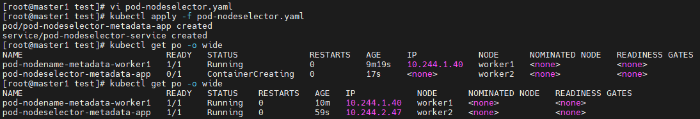
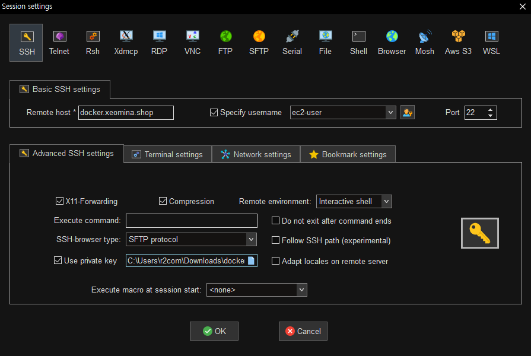
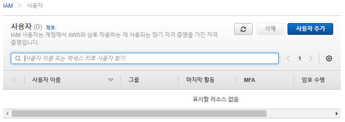
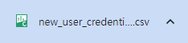
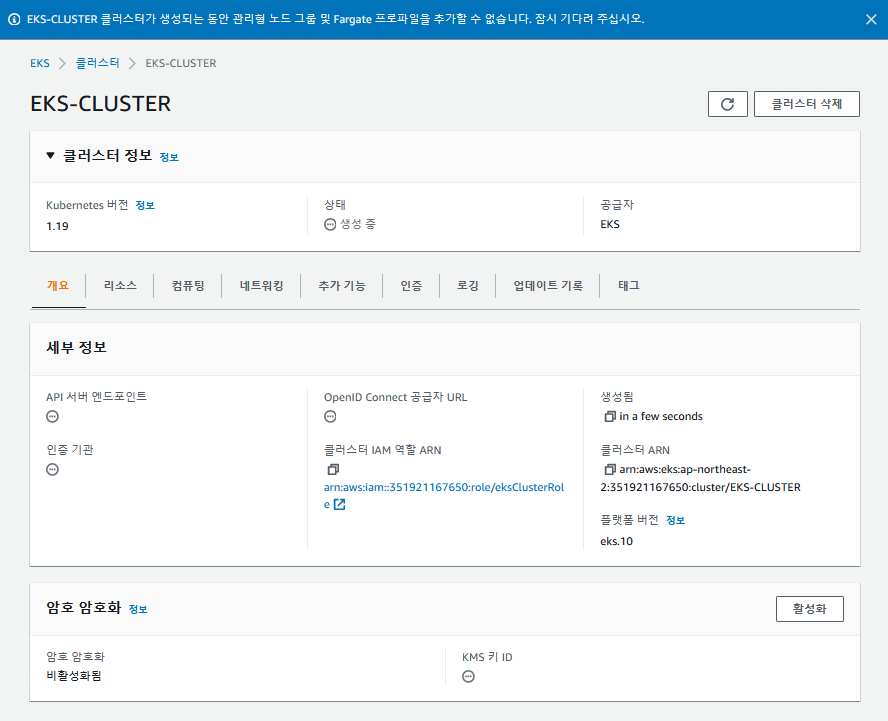

# 0721

* 시작 전 체크

```
# docker login
# kubectl create secret generic xeomina --from-file=.dockerconfigjson=/root/.docker/config.json --type=kubernetes.io/dockerconfigjson
# kubectl patch -n default serviceaccount/default -p '{"imagePullSecrets":[{"name": "xeomina"}]}'
# kubectl describe serviceaccount default -n default
```


# Kubernetes

## 파드 노드네임 (수동 배치)

* `pod-nodename.yaml` 파일 생성

```
# vi pod-nodename.yaml
apiVersion: v1
kind: Pod
metadata:
  name: pod-nodename-metadata-worker1
  labels:
    app: pod-nodename-labels
spec:
  containers:
  - name: pod-nodename-containers
    image: nginx
    ports:
    - containerPort: 80
  nodeName: worker1
---
apiVersion: v1
kind: Service
metadata:
  name: pod-nodename-service
spec:
  type: NodePort
  selector:
    app: pod-nodename-labels
  ports:
  - protocol: TCP
    port: 80
    targetPort: 80
```

* apply
  * worker1에 생성됨

```
# kubectl apply -f pod-nodename.yaml
# kubectl get po -o wide
```


## 노드 셀렉터 (수동 배치)

* 라벨링
  * `worker2`에 `app=dev`

```
# kubectl label no worker2 app=dev
# kubectl get no --show-labels
```


* `pod-nodeselector.yaml` 파일 생성

```
# vi pod-nodeselector.yaml
apiVersion: v1
kind: Pod
metadata:
  name: pod-nodeselector-metadata-app
  labels:
    app: pod-nodeselector-labels
spec:
  containers:
  - name: pod-nodeselector-containers
    image: nginx
    ports:
    - containerPort: 80
  nodeSelector:
    app: dev
---
apiVersion: v1
kind: Service
metadata:
  name: pod-nodeselector-service
spec:
  type: NodePort
  selector:
    app: pod-nodeselector-labels
  ports:
  - protocol: TCP
    port: 80
    targetPort: 80
```

* apply

```
# kubectl apply -f pod-nodeselector.yaml
# kubectl get po -o wide
```




* 라벨 삭제
  * `[노드 이름] <key> -`

```
# kubectl label no worker2 app-
# kubectl get no --show-labels
```


## taint와 toleration

* master1 node 확인
  * `NoSchedule` : 자동배치에서 스케쥴러가 pod 생성을 node에 배치하지 않음

```
# kubectl describe no master1
```


### taint

* taint

```
# kubectl taint no worker1 key1=value1:NoSchedule
# kubectl taint no worker2 key1=value1:NoSchedule
```

* taint 확인

```
# kubectl describe no worker1 | grep Taints:
# kubectl describe no worker2 | grep Taints:
```


* pod 생성
  *  pending 상태

```
# kubectl run test-taint --image=nginx
# kubectl get po -o wide
```


### toleration

* `pod-taint.yaml` 파일 생성

```
# vi pod-taint.yaml
apiVersion: v1
kind: Pod
metadata:
  name: pod-taint-metadata
  labels:
    app: pod-taint-labels
spec:
  containers:
  - name: pod-taint-containers
    image: nginx
    ports:
    - containerPort: 80
  tolerations:		# taint 처리 된 node에도 pod 배치 가능
  - key: "key1"
    operator: "Equal"
    value: "value1"
    effect: "NoSchedule"
---
apiVersion: v1
kind: Service
metadata:
  name: pod-taint-service
spec:
  type: NodePort
  selector:
    app: pod-taint-labels
  ports:
  - protocol: TCP
    port: 80
    targetPort: 80
```

* apply

```
# kubectl apply -f pod-taint.yaml
# kubectl get po -o wide
```


# Amazon EKS

## 개념

https://docs.aws.amazon.com/ko_kr/eks/latest/userguide/what-is-eks.html

* Amazon Elastic Kubernetes Service (Amazon EKS)는 클라우드 또는 온프레미스에서 Kubernetes 애플리케이션을 실행하고 크기를 조정하는 관리형 컨테이너 서비스입니다.

* Amazon Elastic Kubernetes Service(Amazon EKS)는 Kubernetes를 실행하는 데 사용할 수 있는 관리형 서비스입니다. AWS Kubernetes 제어 플레인 또는 노드를 설치, 작동 및 유지 관리할 필요가 없습니다. Kubernetes는 컨테이너화된 애플리케이션의 배포, 조정 및 관리 자동화를 위한 오픈 소스 시스템입니다

* 여러 AWS 가용 영역에 걸쳐 Kubernetes 제어 플레인을 실행하고 크기 조정하여 높은 가용성을 보장합니다.

* 는 하중에 따라 제어 영역 인스턴스의 크기를 자동으로 조정하고, 비정상 제어 영역 인스턴스를 감지하고 교체하며, 자동화된 버전 업데이트 및 패치를 제공합니다.

* 또한 여러 AWS 서비스와 통합되어 다음 기능을 포함한 애플리케이션에 대한 확장성과 보안을 제공합니다.

  - 컨테이너 이미지에 대한 Amazon ECR
  - 로드 분산을 위한 Elastic Load Balancing
  - 인증용 IAM
  - 격리를 위한 Amazon VPC

* 오픈 소스 Kubernetes 소프트웨어의 최신 버전을 실행하므로 Kubernetes 커뮤니티에서 모든 기존 플러그 인과 도구를 사용할 수 있습니다. Amazon EKS에서 실행되는 애플리케이션은 온프레미스 데이터 센터에서 실행 중이든 퍼블릭 클라우드에서 실행 중이든 상관없이 모든 표준 Kubernetes 환경에서 실행되는 애플리케이션과 완벽하게 호환됩니다. 즉, 필요한 코드를 수정하지 않고 표준 Kubernetes 애플리케이션을 Amazon EKS로 쉽게 마이그레이션할 수 있습니다.

* 클라우드에서 Amazon EKS를 사용하여 애플리케이션 배포

  

* Amazon EKS Anywhere를 사용하여 애플리케이션 배포

  

* 자체 도구를 사용하여 애플리케이션 배포

  


### Amazon EKS 제어 영역 아키텍처

* Amazon EKS 는 각 클러스터에 대해 단일 테넌트 Kubernetes 제어 영역을 실행합니다. 컨트롤 플레인 인프라는 클러스터 또는 AWS 계정 간에 공유되지 않습니다. 제어 플레인은 2개 이상의 API 서버 인스턴스와 AWS 리전 내 3개의 가용 영역에서 실행되는 3개의 `etcd` 인스턴스로 구성됩니다
* Amazon EKS는 Amazon VPC 네트워크 정책을 사용하여 제어 영역 구성 요소 간의 트래픽을 단일 클러스터 내로 제한합니다. 클러스터에 대한 제어 영역 구성 요소는 Kubernetes RBAC 정책에 따라 권한을 부여받지 않은 경우 다른 클러스터 또는 다른 AWS 계정의 통신을 보거나 수신할 수 없습니다. 이 안전하고 가용성이 높은 구성을 통해 Amazon EKS는 프로덕션 워크로드에 안정적이고 권장됩니다.


출처 : https://aws.amazon.com/ko/getting-started/hands-on/deploy-kubernetes-app-amazon-eks/


### Amazon EKS는 어떻게 작동합니까?


* Amazon EKS 손쉽게 시작하기:

1. AWS Management Console 또는 AWS CLI를 사용하거나 AWS SDK를 사용하여 Amazon EKS를 생성합니다.
2. 관리형 또는 자체 관리형 Amazon EC2 노드를 실행하거나 워크로드를 AWS Fargate에 배포합니다.
3. 클러스터가 준비되면 원하는 Kubernetes 도구(예: `kubectl`)를 구성하여 클러스터와 통신할 수 있습니다.
4. 다른 Kubernetes 환경에서와 마찬가지로 Amazon EKS 클러스터에 워크로드를 배포 및 관리합니다. AWS Management Console을 사용하여 노드 및 워크로드에 대한 정보를 볼 수도 있습니다.


## 실습

### EC2 docker

* 도커 EC2 생성 - 사용자 데이터
  * api 도구 & docker host & master node에 접근하는 client
* AWS CLI 명령어 사용 : `awscliv2.zip` 파일
  * completion : 자동화


```
#!/bin/bash
cd /tmp
curl "https://awscli.amazonaws.com/awscli-exe-linux-x86_64.zip" -o "awscliv2.zip"
unzip awscliv2.zip
./aws/install
amazon-linux-extras install docker -y
systemctl enable --now docker
curl https://raw.githubusercontent.com/docker/docker-ce/master/components/cli/contrib/completion/bash/docker -o /etc/bash_completion.d/docker.sh
sudo usermod -a -G docker ec2-user
```


* 도메인


* ssh



* docker & aws 확인

```
$ docker version
$ aws --version
```


* docker hub
  * image 확인


* docker container 실행

```
$ docker run -d -p 80:80 --name test-site xeomina/web-site:v2.0
$ docker ps
```


* website 접속


### IAM

* AWS EKS 클러스터 IAM 역할 생성

#### 사용자

* 사용자 추가



* 1단계
  * CLI, Web UI 접속
  * 액세스 키, 암호 액세스 


* 2단계
  * 기존 정책 직접 연결
    * AdministratorAccess


* 3단계
  * 태그 선택사항


* 4단계
  * 검토


* 5단계
  * csv 다운로드


* 분실하면 안됨




#### 역할

* 역할 만들기


* 1단계
  * 일반 사용 사례 : EC2


* 2단계
  * 권한 추가 : AmazonS3FullAccess


* 3단계


* 생성 완료


### S3

* 버킷 만들기


* 생성 완료


* ssh
  * credentials로 s3 접근

```
$ aws s3 ls
$ aws configure
AWS Access Key ID [None]: AK~
AWS Secret Access Key [None]: tj~
Default region name [None]: ap-northeast-2
Default output format [None]: json
$ aws s3 ls
```


* `.aws` 파일에 credentials 저장됨
  * 삭제하면 접근 불가

```
$ ls -al
$ rm -rf .aws
$ aws s3 ls
```


* EC2 인스턴스 IAM 역할 수정
  * `s3-role`


* s3 역할로 접근

```
$ aws s3 ls
```


* 역할 분리


### ECR

* 리포지토리


* `public.ecr.aws/l1b8t9f0/web-site`
  * 푸시 명령 보기


* 레지스트리에 대해 Docker 클라이언트 인증

```
$ aws configure
$ aws ecr-public get-login-password --region us-east-1 | docker login --username AWS --password-stdin public.ecr.aws/l1b8t9f0
```


* docker image build & push

```
$ docker tag xeomina/web-site:v2.0 public.ecr.aws/l1b8t9f0/web-site:v1.0
$ docker images
$ docker push public.ecr.aws/l1b8t9f0/web-site:v1.0
```


* 리포지토리에서 이미지 확인


## EKS CLI

### IAM 역할 생성

> 루트계정

* EKS Cluster 역할 만들기


### IAM 사용자 로그인

* 루트 계정 ID 복사


* IAM 사용자 로그인


### 클러스터 생성

> IAM 사용자


* 작업 노드의 서브넷 지정
  * 실무에서는 다..


* 지금은 퍼블릭 ip 사용
  * 프라이빗 ip - bastion host


* CNI 설정


**Amazon VPC CNI 플러그인 (vpc-cni)**

* Amazon EKS는 Kubernetes용 Amazon VPC CNI (Container Network Interface) 플러그인을 사용하여 네이티브 VPC 네트워킹을 지원합니다. 이 플러그인을 사용하면 Kubernetes 포드가 VPC 네트워크에서와 동일한 IP  주소를 포드 내에서 가질 수 있습니다.
* flannel


* 마스터 노드 = 제어 플레인





### kubectl 설치

https://docs.aws.amazon.com/ko_kr/eks/latest/userguide/install-kubectl.html


```
$ curl -o kubectl https://s3.us-west-2.amazonaws.com/amazon-eks/1.19.6/2021-01-05/bin/linux/amd64/kubectl
```

* 권한 설정 및 이동

```
$ chmod +x ./kubectl
$ ls
$ sudo mv ./kubectl /usr/local/bin
$ ls /usr/local/bin
```


* 자동완성

```
$ source <(kubectl completion bash)
$ echo "source <(kubectl completion bash)" >> ~/.bashrc		# 세션 껐다켜도
$ kubectl version --short --client
```


* 클러스터 자격증명 확인

```
$ aws eks --region ap-northeast-2 update-kubeconfig --name EKS-CLUSTER
$ kubectl get svc
```


### 클러스터 노드 그룹

* nodegroup 역할 만들기
  * AmazonEKSWorkerNodePolicy
  * AmazonEC2ContainerRegistryReadOnly
  * AmazonEKS_CNI_Policy

> 루트 사용자 IAM


* 노드 그룹 추가


* 검토


* Ec2SubnetInvalidConfiguration 에러
  * public subnet에 자동으로 public IP 할당..

```
상태 문제 (1)
문제 유형
설명
	
영향을 받는 리소스
Ec2SubnetInvalidConfiguration	One or more Amazon EC2 Subnets of [subnet-02beaca6e4fb9d1d6, subnet-0d8780d54d0724ee2] for node group NODEGROUP does not automatically assign public IP addresses to instances launched into it. If you want your instances to be assigned a public IP address, then you need to enable auto-assign public IP address for the subnet. See IP addressing in VPC guide: https://docs.aws.amazon.com/vpc/latest/userguide/vpc-ip-addressing.html#subnet-public-ip	
subnet-02beaca6e4fb9d1d6
subnet-0d8780d54d0724ee2
```

* 인스턴스 생성 확인
  * worker1 : 13.124.233.228
  * worker2 : 13.124.71.216


* 노드 확인

```
$ kubectl get no
```


### pod

* pod 생성

```
$ mkdir workspace && cd $_
$ kubectl run nginx-pod --image nginx
$ kubectl get po -o wide
$ kubectl run nginx-pod2 --image nginx
$ kubectl get po -o wide
$ kubectl run nginx-pod3 --image nginx
$ kubectl run nginx-pod4 --image nginx
```

* pending...
  * pod 한도 초과


* 노드 추가
  * worker3, 4


* pod 추가 생성


* pod 할당량 확인

```
$ kubectl get nodes -o jsonpath="{range .items[*]}{.metadata.labels['beta\.kubernetes\.io\/instance-type']}{'\t'}{.status.capacity.pods}{'\n'}{end}"

$ kubectl describe no ip-10-23-39-129.ap-northeast-2.compute.internal | grep -i pods
```


* 최대 4개인데 왜  pending?
  * 이미 시스템 pod가 생성되어 있기 때문
    * worker 1,2 : 3개
    * worker 3,4 : 2개


### ClusterIP svc

* ClusterIP svc 생성

```
$ kubectl run nginx-pod --image nginx

$ kubectl expose pod nginx-pod --name clusterip --type ClusterIP --port 80
$ kubectl get svc
```

* Cluster IP 접속
  * master는 클러스터 안에 있지 않음 - 클러스터 ip로 접속 불가 !
  * worker 노드에서 접속 테스트 해야 함

```
$ curl 172.20.194.86	# 접속 불가
```


* worker 1

```
$ curl 172.20.194.86
```


### NodePort svc

* NodePort 생성

```
$ kubectl expose pod nginx-pod --name nodeport --type NodePort --port 80
$ kubectl get svc
```

* NodePort 접속
  * worker1의 내부 ip : 10.23.7.86
  * master에서는 접속 불가

```
$ curl 10.23.7.86:30044
```


* worker 1


* worker 2


* public ip에 노드포트로 접속
  * worker1의 public ip : 13.124.233.228
  * 외부에서 접속 불가...왜? 보안그룹 !


* 보안그룹 수정
  * remoteAccess


* 다시 worker1 public ip 접속


* 보안그룹 설정 변경
  * 내 ip만 허용하고 master 및 worker 노드의 ip는 허용 x
  * ssh 불가 & 웹으로만 접속 가능


* 웹 접속


**Cf) 노드포트**

*  프라이빗 - 퍼블릭 ip 일대일 대응 - 퍼블릭 ip로 외부에서 접속 가능하도록???


* 보안그룹 : 일단 모두 허용으로 다시 설정....


### LoadBalancer svc

* LoadBalancer 생성
  *  지금은 external IP 지정해도 어차피 접속 불가

```
$ kubectl expose pod nginx-pod --name loadbalancer --type LoadBalancer --port 80
$ kubectl get svc
```

* 자동으로 CLB 부여
  * EKS가...직접 node 만들었다면 안줌..이땐 external ip 사용해야 할 것


* 로드밸런서 확인
  * InService


* DNS로 접속


* 도메인 지정


* 도메인으로 접속


### **Cf) target port**

* nginx가 오픈하는 포트 번호 : `80`
* 컨테이너 안, 즉 파드로 들어올 때 타켓포트 `80`으로 연결
* 따라서 svc에서 타겟 포트 번호는 변경하면 안됨
* [참고 사이트](https://kimmj.github.io/kubernetes/port-targetport-nodeport-in-kubernetes/)


* `index.html` 변경

```
$ kubectl exec nginx-pod -- sh -c "echo 'Hello World' > /usr/share/nginx/html/index.html"
```

* 접속


## pod-loadbalancer

* `pod-loadbalancer.yaml` 파일 생성

```
$ vi pod-loadbalancer.yaml
apiVersion: v1
kind: Pod
metadata:
  name: nginx-pod-web
  labels:
    app: nginx-pod
spec:
  containers:
  - name: nginx-pod-container
    image: public.ecr.aws/l1b8t9f0/web-site:v1.0
---
apiVersion: v1
kind: Service
metadata:
  name: loadbalancer-service-pod
spec:
  type: LoadBalancer
  selector:
    app: nginx-pod
  ports:
  - protocol: TCP
    port: 80
    targetPort: 80
```


* apply

```
$ kubectl apply -f pod-loadbalancer.yaml
$ kubectl get all
```


* 도메인 설정


* web.xeomina.shop 접속


## 삭제

### 노드그룹 삭제