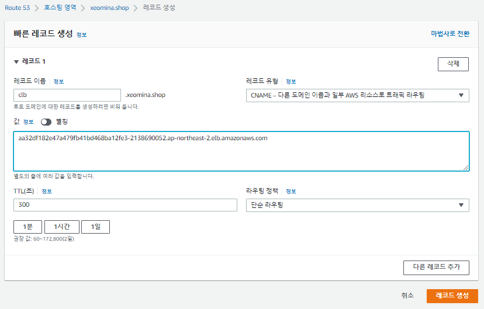
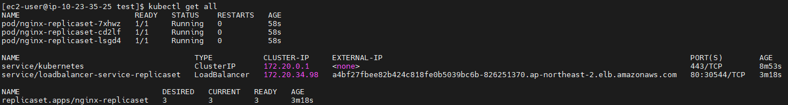
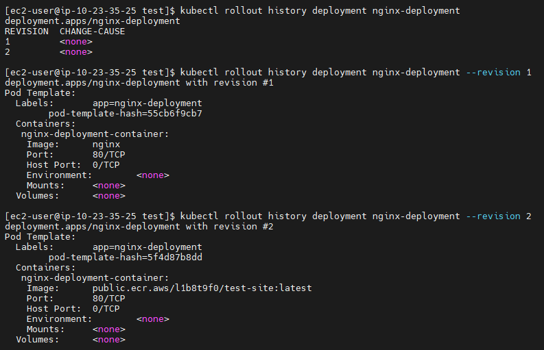

# 0722

## EC2 인스턴스 생성


* 사용자 데이터

```
#!/bin/bash
cd /tmp
curl "https://awscli.amazonaws.com/awscli-exe-linux-x86_64.zip" -o "awscliv2.zip"
unzip awscliv2.zip
./aws/install
amazon-linux-extras install docker -y
systemctl enable --now docker
curl https://raw.githubusercontent.com/docker/docker-ce/master/components/cli/contrib/completion/bash/docker -o /etc/bash_completion.d/docker.sh
usermod -a -G docker ec2-user
docker run -d -p 80:80 --name=test-site xeomina/web-site:v1.0
```


* IP 복사


* 레코드 생성


* 도메인 접속


* ssh


* 도커 컨테이너 확인

```
$ docker ps
$ docker images
```


## 리포지토리 생성


* 푸시 명령 보기


* test-site에 대한 푸시 명령


### 이미지 push

* aws configure

```
$ aws configure
AWS Access Key ID [None]:
AWS Secret Access Key [None]:
Default region name [None]: ap-northeast-2
Default output format [None]: json
```


* 인증 토큰을 검색하고 레지스트리에 대해 Docker 클라이언트 인증

```
$ aws ecr-public get-login-password --region us-east-1 | docker login --username AWS --password-stdin public.ecr.aws/l1b8t9f0
```

* 도커 이미지 빌드
  * 이미 빌드함

```
$ docker build -t test-site .
```

* 이미지에 태그를 지정하여 리포지토리에 푸시

```
$ docker tag test-site:latest public.ecr.aws/l1b8t9f0/test-site:latest
$ docker push public.ecr.aws/l1b8t9f0/test-site:latest
```


* 이미지 확인

```
$ docker images
```


## 클러스터 생성

> IAM 사용자

### 클러스터 구성


### 네트워킹 지정


* Amazon VPC CNI : 클러스터 내에서 포드 네트워킹을 활성화
  * Amazon EKS는 Kubernetes용 Amazon VPC CNI(Container Network Interface)  플러그인을 사용하여 네이티브 VPC 네트워킹을 지원합니다. 이 플러그인을 사용하면 Kubernetes 포드가 VPC 네트워크에서와 동일한 IP 주소를 포드 내에서 가질 수 있습니다.
  * [Amazon VPC CNI 플러그인](https://docs.aws.amazon.com/ko_kr/eks/latest/userguide/pod-networking.html)
* CoreDNS : 클러스터 내에서 서비스 검색을 활성화
  * CoreDNS는 EKS Kubernetes 클러스터 내에서 DNS 서비스를 제공합니다. DNS를 사용하면 개별 컨테이너가 클러스터 내의 다른 컨테이너를 쉽게 검색하고 연결할 수 있습니다. 이 추가 기능은 기본적으로 모든 EKS 클러스터에 포함되어 있습니다.
  * [서비스 및 포드의 DNS](https://kubernetes.io/ko/docs/concepts/services-networking/dns-pod-service/)
* kube-proxy : 클러스터 내에서 포드 네트워킹을 활성화
  * kube-proxy는  Kubernetes 클러스터의 각 노드에서 실행되는 네트워크 프록시입니다. kube-proxy 역할은 클러스터에 정의된 서비스를  반영하고 노드에서 네트워킹 규칙을 관리하여 서비스를 지원하는 포드와의 통신을 허용하는 것입니다. 이 추가 기능은 기본적으로 모든 EKS 클러스터에 포함되어 있습니다.
  * [Kubernetes 설명서의 kube-proxy](https://kubernetes.io/ko/docs/concepts/overview/components/)


### 로깅 구성

* 제어 플레인 로깅 : Amazon EKS 제어 플레인에서 CloudWatch Logs로 감사 및 진단 로그를 전송
  * Amazon EKS 제어 플레인 로깅은 Amazon EKS 제어 플레인에서 계정의 CloudWatch Logs로 감사 및 진단 로그를 직접 제공합니다. 다음과 같은 클러스터 제어 플레인 로그 유형을 사용할 수 있습니다. 각 로그 유형은 Kubernetes 제어 플레인의 구성 요소에 해당합니다
  *  [Kubernetes 구성 요소](https://kubernetes.io/ko/docs/concepts/overview/components/)


## kubectl 설치

* [AWS docs](https://docs.aws.amazon.com/ko_kr/eks/latest/userguide/install-kubectl.html)

* Amazon S3에서 `kubectl` 바이너리 다운로드
  * Kubernetes 1.22

```
$ curl -o kubectl https://s3.us-west-2.amazonaws.com/amazon-eks/1.22.6/2022-03-09/bin/linux/amd64/kubectl
```

* 바이너리에 실행 권한 적용 및 경로 이동

```
$ chmod +x ./kubectl
$ sudo mv ./kubectl /usr/local/bin
```

* cli 자동완성

```
$ source <(kubectl completion bash)
$ echo "source <(kubectl completion bash)" >> ~/.bashrc
$ kubectl version --short --client
```


* 클러스터 자격증명 확인

```
$ aws eks --region ap-northeast-2 update-kubeconfig --name EKS-CLUSTER
$ kubectl get svc
```


## NodeGroup-Spot

### 노드 그룹 구성


### 컴퓨팅 및 조정 구성 설정


### 네트워킹 지정


### 노드 그룹 생성 완료


**Cf) Auto Scaling**

* [참고 사이트1](https://www.samsungsds.com/kr/insights/kubernetes-3.html)
* [참고 사이트2](https://kubernetes.io/ko/docs/concepts/overview/components/)
* [참고 사이트3](https://brunch.co.kr/@alden/66)

* 컨트롤 플레인(Control Plane) 컴포넌트(master)가 원하는 용량 정책에 따라 자동으로 spot 인스턴스 생성 ... scale in/out 정책은 아직 없음
  * 지금의 조정 정책은 spot 인스턴스 지워지면 만드는 정책까지만..
  * 과소 트래픽에 따른 조정에 대한 부분은 동적 크기 조정 정책을 설정해줘야 함 !


### 노드 확인

* moba


* aws


## Pod

### 노드 별 pod 확인

* `ip-10-23-4-152`
  * 시스템 pod 몰려있음...pod 한도 갯수 초과


* `ip-10-23-44-255`


### pod 생성

* `ip-10-23-44-255` node에만 생성됨

```
$ kubectl run nginx-pod1 --image nginx
$ kubectl run nginx-pod2 --image nginx
$ kubectl get po -o wide
```


## LoadBalancer 

### 로드밸런서 생성

```
$ kubectl expose pod nginx-pod1 --name loadbalancer --type LoadBalancer --port 80
$ kubectl get svc
```


* 로드 밸런서 확인


* 로드밸런서 엔드포인드 CNAME으로 변경
  * CNAME보다는 별칭이 더 저렴




### 리스너 편집

* https 사용하도록


* SSL 인증서


* 보안그룹


* https 접속


----

**Cf) 보안그룹**

* `eks-remoteAccess` : 관리용
* `eks-cluster-sg` : clb와 worker node 보안 강화
  * 소스(출발지)를 보안그룹 ID로 지정 - 보안그룹에서 오는 트래픽만 허용


* 보안그룹 삭제해보기


* ping 확인


* 매번 ICMP를 열어주는 것 보다 `모든 트래픽`으로 지정 후 소스를 자기 자신으로!
  * 동일 보안 그룹내의 vm들은 모든 포트 통신이 가능 !


* 다시 ping


----


## NodeGroup-OnDemand


### 노드 확인


### 도메인 지정


## ReplicaSet-Loadbalancer

* `replica-loadbalancer.yaml` 파일 생성

```
$ mkdir test && cd $_
$ vi replica-loadbalancer.yaml
apiVersion: apps/v1
kind: ReplicaSet
metadata:
  name: nginx-replicaset
spec:
  replicas: 3 # desired state (kube-controller-manager) - 선언적 API, 자가 치유
  selector:
    matchLabels:
      app: nginx-replicaset

  template:
    metadata:
      name: nginx-replicaset
      labels:
        app: nginx-replicaset
    spec:
      containers:
      - name: nginx-replicaset-container
        image: nginx
        ports:
        - containerPort: 80
---
apiVersion: v1
kind: Service
metadata:
  name: loadbalancer-service-replicaset
spec:
  type: LoadBalancer
  selector:
    app: nginx-replicaset
  ports:
  - protocol: TCP
    port: 80
    targetPort: 80
```


* apply

```
$ kubectl apply -f replica-loadbalancer.yaml
```


* 확인

```
$ kubectl get all
```



* edit `nginx-replicaset`
  * replica: `4`

```
$ kubectl edit rs nginx-replicaset
$ kubectl get all
```


* 확인

```
$ kubectl get all
```


* loadbalancer 확인

```
$ kubectl exec nginx-replicaset-7xhwz -- sh -c "echo '<h1>WEB01</h1>' > /usr/share/nginx/html/index.html"
...
$ kubectl exec nginx-replicaset-lsgd4 -- sh -c "echo '<h1>WEB04</h1>' > /usr/share/nginx/html/index.html"
```


* 삭제해보기
  * replica 최소 4개 계속 유지

```
$ kubectl delete pod nginx-replicaset-8qchx
$ kubectl get po
```


##

*

```
apiVersion: apps/v1
kind: Deployment
metadata:
  name: nginx-deployment
spec:
  replicas: 4
  selector:
    matchLabels:
      app: nginx-deployment
  template:
    metadata:
      name: nginx-deployment
      labels:
        app: nginx-deployment
    spec:
      containers:
      - name: nginx-deployment-container
        image: nginx
        ports:
        - containerPort: 80
```


```
$ kubectl apply -f deployment.yaml
$ kubectl get all
```


## ClusterIP

### public IP 

*   external IP에 worker1의 public IP : `3.35.136.3`

```
# vi clusterip-deployment.yaml
apiVersion: v1
kind: Service
metadata:
  name: clusterip-service-deployment
spec:
  type: ClusterIP
  externalIPs:
  - 3.35.136.3
  selector:
    app: nginx-deployment
  ports:
  - protocol: TCP
    port: 80
    targetPort: 80
```


* apply

```
$ kubectl apply -f clusterip-deployment.yaml
$ kubectl get all
```


* worker1의 보안그룹 수정해보기


* curl

```
$ curl 3.35.136.3
```


* **public IP를 굳이 external로 설정할 필요도 없고 접속도 안됨..!**


### private IP

*  external IP에 worker1의 private IP : `10.23.12.7`

```
$ vi clusterip-deployment.yaml
apiVersion: v1
kind: Service
metadata:
  name: clusterip-service-deployment
spec:
  type: ClusterIP
  externalIPs:
  - 10.23.12.7
  selector:
    app: nginx-deployment
  ports:
  - protocol: TCP
    port: 80
    targetPort: 80
```


* apply

```
$ kubectl apply -f clusterip-deployment.yaml
$ kubectl get svc
```


* worker1의 public IP로 접속
  * `3.35.136.3`


* 모든 worker 노드의 private IP를 external IP로 설정
  * worker1 : `10.23.12.7`
  * worker2 :  `10.23.9.100`
  * worker3 : `10.23.33.116`
  * worker4 : `10.23.43.166`

```
$ vi clusterip-deployment.yaml
apiVersion: v1
kind: Service
metadata:
  name: clusterip-service-deployment
spec:
  type: ClusterIP
  externalIPs:
  - 10.23.12.7
  - 10.23.9.100
  - 10.23.33.116
  - 10.23.43.166
  selector:
    app: nginx-deployment
  ports:
  - protocol: TCP
    port: 80
    targetPort: 80
```


* apply

```
$ kubectl apply -f clusterip-deployment.yaml
$ kubectl get svc
```


* 도메인으로 접속


### 정리

- 클러스터 내에서 external IP 설정은 private IP로
- 외부에서 접속은 public IP로 ! 
- 어차피 private IP와 public IP는 일대일로 매핑되어 있음


## LoadBalancer

* `loadbalancer-deployment.yaml` 파일 생성

```
$ vi loadbalancer-deployment.yaml
apiVersion: v1
kind: Service
metadata:
  name: loadbalancer-service-deployment
spec:
  type: LoadBalancer
  externalIPs:
  - 10.23.12.7
  - 10.23.9.100
  - 10.23.33.116
  - 10.23.43.166
  selector:
    app: nginx-deployment
  ports:
  - protocol: TCP
    port: 80
    targetPort: 80
```


```
$ kubectl apply -f loadbalancer-deployment.yaml
$ kubectl get svc
```


* `ac3dbccb9f5e04189aff3957e85d8207-1212786903.ap-northeast-2.elb.amazonaws.com/`


* 도메인에 등록


## Deployment 롤링 업데이트

* Deployment 이미지 변경
  * replicas에는 업데이트 불가
* 컨테이너 이름 검색 `nginx-deployment-container` > image set `public.ecr.aws/l1b8t9f0/test-site:latest`


```
$ kubectl set image deployment.apps/nginx-deployment nginx-deployment-container=public.ecr.aws/l1b8t9f0/test-site:latest
```


* 이미지 변경 확인


* 히스토리 확인
  * `rollout history`

```
$ kubectl rollout history deployment nginx-deployment
$ kubectl rollout history deployment nginx-deployment --revision 1
$ kubectl rollout history deployment nginx-deployment --revision 2
```




* `set image` 반복

```
$ kubectl set image deployment.apps/nginx-deployment nginx-deployment-container=halilinux/test-home:v0.0
$ watch kubectl get po

$ kubectl set image deployment.apps/nginx-deployment nginx-deployment-container=halilinux/test-home:v1.0
$ watch kubectl get po

$ kubectl set image deployment.apps/nginx-deployment nginx-deployment-container=halilinux/test-home:v2.0
$ watch kubectl get po
```


* 히스토리 확인

```
$ kubectl rollout history deployment nginx-deployment --revision 3
$ kubectl rollout history deployment nginx-deployment --revision 4
$ kubectl rollout history deployment nginx-deployment --revision 5
```


* 원상 복구
  * `rollout undo`

```
$ kubectl rollout undo deployment nginx-deployment --to-revision 2
$ watch kubectl get po
```


* 이미지 확인


* edit
  * `revisionHistoryLimit`를 `20`으로 수정

```
$ kubectl edit deployments.apps nginx-deployment
$ kubectl rollout history deployment nginx-deployment
```


* history 확인


## wordpress

* `wordpress-pod-svc.yaml` 파일 생성

```
$ vi wordpress-pod-svc.yaml
apiVersion: v1
kind: Pod
metadata:
  name: wordpress-pod			# 127.0.0.1
  labels:
    app: wordpress-pod
spec:
  containers:
  - name: mysql-container
    image: mysql:5.7			# mysql -u root -p, CREATE USER, CREATE DATABASE
    env:
    - name: MYSQL_ROOT_HOST
      value: '%'				# wpuser@%
    - name: MYSQL_ROOT_PASSWORD
      value: as4914
    - name: MYSQL_DATABASE
      value: wordpress
    - name: MYSQL_USER
      value: wpuser
    - name: MYSQL_PASSWORD
      value: wppass
    ports:
    - containerPort: 3306
  - name: wordpress-container
    image: wordpress			# 웹ui에서 입력값
    env:
    - name: WORDPRESS_DB_HOST
      value: wordpress-pod:3306
    - name: WORDPRESS_DB_USER
      value: wpuser
    - name: WORDPRESS_DB_PASSWORD
      value: wppass
    - name: WORDPRESS_DB_NAME
      value: wordpress
    ports:
    - containerPort: 80
---
apiVersion: v1
kind: Service
metadata:
  name: loadbalancer-service-deployment-wordpress
spec:
  type: LoadBalancer
  selector:
    app: wordpress-pod
  ports:
  - protocol: TCP
    port: 80
    targetPort: 80
```


* apply

```
$ kubectl apply -f wordpress-pod-svc.yaml
$ kubectl get svc
```


* 레코드 생성
  * `word.xeomina.shop`


* 웹 접속


* http 접속만 가능 
  * https는 안됨


### https 접속을 위한 설정


#### 보안그룹 수정

* `k8s-elb`


* HTTPS 포트 열기


#### 로드밸런서 리스너 설정

* ACM으로부터 SSL 인증서 받아오기


* SSL 프로토콜에 인스턴스 포트 추가


* 리스터 확인


* pod 삭제 후 다시 설치


* 웹 다시 접속


* SSL 플러그인 설치 및 활성화


* Activate SSL


* https 접속 확인


## metallb (DHCP)

* 다음 시간에..
* `git` 어떻게 설치........?

```
$ git clone https://github.com/hali-linux/_Book_k8sInfra.git
$ kubectl apply -f ~/_Book_k8sInfra/ch3/3.3.4/metallb.yaml
# kubectl get pods -n metallb-system -o wide
```

