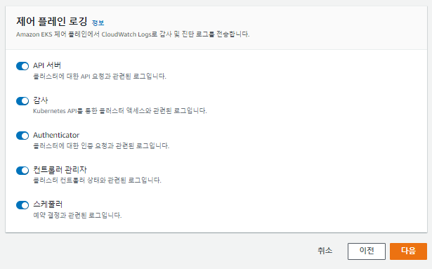
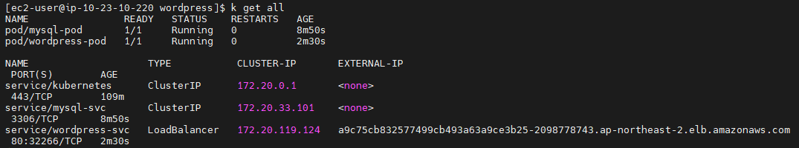

# 0725

## EC2 인스턴스

* docker 인스턴스 생성
  * 사용자 데이터

```
#!/bin/bash
timedatectl set-timezone Asia/Seoul
cd /tmp
curl "https://awscli.amazonaws.com/awscli-exe-linux-x86_64.zip" -o "awscliv2.zip"
unzip awscliv2.zip
./aws/install
amazon-linux-extras install docker -y
systemctl enable --now docker
curl https://raw.githubusercontent.com/docker/docker-ce/master/components/cli/contrib/completion/bash/docker -o /etc/bash_completion.d/docker.sh
usermod -a -G docker ec2-user
docker run -d -p 80:80 --name test-site xeomina/web-site:v2.0
```

## Route 53

* 레코드 생성
  * `docker.xeomina.shop` 
  * `docker` 인스턴스의  public IP : 3.39.236.71

* `docker.xeomina.shop` 접속


## ECR

* 리포지토리 생성
  * 퍼블릭
  * 이름 : `web-site`
* `aws configure` 후 클라이언트 인증

```
$ aws configure
$ aws ecr-public get-login-password --region us-east-1 | docker login --username AWS --password-stdin public.ecr.aws/l1b8t9f0
```

* tag 지정해 push

```
$ aws ecr-public get-login-password --region us-east-1 | docker login --username AWS --password-stdin public.ecr.aws/l1b8t9f0
$ docker images
$ docker tag xeomina/web-site:v2.0 public.ecr.aws/l1b8t9f0/web-site:latest
$ docker images
$ docker push public.ecr.aws/l1b8t9f0/web-site:latest
```


* `docker.xeomina.shop` 접속


## EKS

> IAM 사용자

* 클러스터 생성




* 노드 그룹 추가


## EKS CLI

* login

```
$ aws eks --region ap-northeast-2 update-kubeconfig --name EKS-CLUSTER
```

* kubectl 설치

```
$ curl -o kubectl https://s3.us-west-2.amazonaws.com/amazon-eks/1.22.6/2022-03-09/bin/linux/amd64/kubectl
$ kubectl get svc
$ kubectl get no
$ ls
```


*  바이너리에 실행 권한 적용 및 경로 설정

```
$ chmod +x ./kubectl
$ sudo mv ./kubectl /usr/local/bin
```

* kubectl 자동 완성

```
$ source <(kubectl completion bash)
$ echo "source <(kubectl completion bash)" >> ~/.bashrc
```


* kubectl alias 설정

```
$ vi .bash_profile
alias k=kubectl
complete -F __start_kubectl k
```


* exit 후 확인

```
$ k version
```


---

**Cf) kubectl 자동 완성 활성화 및 별칭 설정 (Bash) **

* 참고 사이트 : [kubectl cheatsheet](https://kubernetes.io/ko/docs/reference/kubectl/cheatsheet/)

- kubectl 자동 완성

```
$ source <(kubectl completion bash)
$ echo 'source <(kubectl completion bash)' >>~/.bashrc
```

- kubectl `k` 별칭 설정

```
$ echo 'alias k=kubectl' >>~/.bashrc
```

- 별칭 설정 후 자동 완성 설정

```
$ echo 'complete -F __start_kubectl k' >>~/.bashrc
```

- 설정 적용(세션 재시작 및)

```
$ exec $SHELL
```


**Cf) metallb**

* 퍼블릭 클라우드에서는 사용 불가... 온프레미스에서 사용!
* 퍼블릭 클라우드는 자체적 로드밸런서 보유... 굳이 metallb 기능 활성화할 필요 x

---


## Volume CLI

### pv, pvc로  볼륨 연결

* 볼륨 생성

```
$ aws ec2 create-volume --availability-zone=ap-northeast-2a --size=1 --volume-type=gp2
```


* node 확인
  * 서브넷 2a : `10.23.0.0/20` ~ `10.23.15.0/20`


### 오류

* `aws-vol.yaml` 파일 생성

```
$ vi aws-vol.yaml
apiVersion: v1
kind: PersistentVolume
metadata:
  name: pv-aws
  labels:
    types: local
spec:
  capacity:
    storage: 1Gi
  persistentVolumeReclaimPolicy: Retain
  accessModes:
    - ReadWriteOnce		# 접근제한 (하나의 노드만)
  awsElasticBlockStore:
    fsType: ext4
    volumeID: vol-014065d5d324f3805
---
apiVersion: v1
kind: PersistentVolumeClaim
metadata:
  name: pvc-aws
  namespace: default
spec:
  accessModes:
    - ReadWriteOnce
  resources:
    requests:
      storage: 1Gi	# label/selector 설정안해도 비슷한 크기끼리 연결
  selector:
    matchLabels:
      type: local
---
apiVersion: v1
kind: Pod
metadata:
  name: pod-aws
  namespace: default
spec:
  containers:
    - name: test
      image: nginx
      volumeMounts:
        - mountPath: "/usr/share/nginx/html"	# 컨테이너 안쪽 경로
          name: pvc
  nodeName: ip-10-23-12-108.ap-northeast-2.compute.internal	# 노드 지정: 워커노드와 볼륨이 같은 가용영역 내에 있어야 함
  volumes:
    - name: pvc		# 컨테이너 안쪽의 volumeMount와 동일해야
      persistentVolumeClaim:
        claimName: pvc-aws		# pvc로 연결
```


* apply
  * `pvc` : `Pending` 
  * error !!

```
$ k apply -f aws-vol.yaml
$ k get pv,pvc,pod
```


* `waiting for first consumer to be created before binding`


* `gp2` storage class 확인
  * `VolumeBindingMode:     WaitForFirstConsumer`

```
$ k describe sc gp2
```


### 해결

* 먼저 이전에 생성한 `gp2` sc 삭제

```
$ k delete sc gp2
```


* `aws-sc.yaml` 파일 생성
  * [storage-classes](https://kubernetes.io/ko/docs/concepts/storage/storage-classes/)

```
apiVersion: storage.k8s.io/v1
kind: StorageClass
metadata:
  name: gp2
  annotations:
    storageclass.kubernetes.io/is-default-class: "true"
provisioner: kubernetes.io/aws-ebs
parameters:
  type: gp2
  fsType: ext4 
```


* apply
  * `VOLUMEBINDINGMODE` : `Immediate`

```
$ k apply -f aws-sc.yaml
$ k get sc
```


* `aws-vol.yaml` 파일 수정

```
$ vi aws-vol.yaml
apiVersion: v1
kind: PersistentVolume
metadata:
  name: pv-aws
spec:
  storageClassName: gp2
  capacity:
    storage: 1Gi
      #  persistentVolumeReclaimPolicy: Retain
  accessModes:
    - ReadWriteOnce
  awsElasticBlockStore:
    fsType: ext4
    volumeID: vol-014065d5d324f3805
---
apiVersion: v1
kind: PersistentVolumeClaim
metadata:
  name: pvc-aws
  namespace: default
spec:
  accessModes:
    - ReadWriteOnce
  resources:
    requests:
      storage: 1Gi
---
apiVersion: v1
kind: Pod
metadata:
  name: pod-aws
  namespace: default
  labels:
    app: pod-aws
spec:
  containers:
    - name: test
      image: nginx
      volumeMounts:
        - mountPath: "/usr/share/nginx/html"
          name: pvc
  nodeName: ip-10-23-12-108.ap-northeast-2.compute.internal
  volumes:
    - name: pvc
      persistentVolumeClaim:
        claimName: pvc-aws
---
apiVersion: v1
kind: Service
metadata:
  name: nodeport-service-pod
spec:
  type: NodePort
  selector:
    app: pod-aws
  ports:
  - protocol: TCP
    port: 80
    targetPort: 80
    nodePort: 30080
```


* apply

```
$ k apply -f aws-vol.yaml
$ k get pv,pvc,pod
```


* 확인

```
$ k get all
$ k get po -o wide
```


* 보안그룹 인바운드 규칙 편집
  * TCP 30080 : `Nodeport` 오픈


* curl

```
$ curl 10.23.12.108:30080
```


*  워커노드 접속
  * 아직 볼륨 마운트 x

```
$ lsblk
$ df -h
```


* 마운트

```
$ sudo mount /dev/xvdcy /mnt
$ df -h
```


* `index.html` 파일 생성

```
$ sudo vi /mnt/index.html
Hello World
$ curl 10.23.12.108:30080
```


* public IP로 접속
  * 노드포트


### EBS 볼륨 직접 연결

* 볼륨 생성
  * 가용영역 : `ap-northeast-2c`

```
$ aws ec2 create-volume --availability-zone=ap-northeast-2c --size=1 --volume-type=gp2
```

* `test-ebs.yaml`

```
$ vi test-ebs.yaml
apiVersion: v1
kind: Pod
metadata:
  name: test-ebs
  labels:
    app: test-ebs
spec:
  containers:
  - image: nginx
    name: test-container
    volumeMounts:
    - mountPath: "/usr/share/nginx/html"
      name: test-volume
  nodeName: ip-10-23-33-104.ap-northeast-2.compute.internal
  volumes:
  - name: test-volume
    # This AWS EBS volume must already exist.
    awsElasticBlockStore:
      volumeID: ""vol-0d2890cc6c31653df"
      fsType: ext4
---
apiVersion: v1
kind: Service
metadata:
  name: test-ebs-svc
spec:
  type: NodePort
  selector:
    app: test-ebs
  ports:
  - protocol: TCP
    port: 80
    targetPort: 80
    nodePort: 30080
```


* apply

```
$ k get all
$ k get po -o wide
```


*  워커노드 접속
  * 아직 볼륨 마운트 x

```
$ lsblk
$ df -h
```


* 마운트

```
$ sudo mount /dev/xvdcy /mnt
$ df -h
```


* `index.html` 파일 생성

```
$ sudo vi /mnt/index.html
Hello World
$ curl 10.23.12.108:30080
```


* public IP로 접속
  * 노드포트


## ConfigMap

* `configmap-wordpress.yaml` 파일 생성

```
# vi configmap-wordpress.yaml
apiVersion: v1
kind: ConfigMap
metadata:
  name: config-wordpress
  namespace: default
data:
  MYSQL_ROOT_HOST: '%'
  MYSQL_ROOT_PASSWORD: as4914
  MYSQL_DATABASE: wordpress
  MYSQL_USER: wpuser
  MYSQL_PASSWORD: wppass
```

* apply

```
$ k apply -f configmap-wordpress.yaml
$ k describe configmaps config-wordpress
```


* `mysql-pod-svc.yaml` 파일 생성
  * cluster IP만..

```
# vi mysql-pod-svc.yaml
apiVersion: v1
kind: Pod
metadata:
  name: mysql-pod
  labels:
    app: mysql-pod
spec:
  containers:
  - name: mysql-container
    image: mysql:5.7
    envFrom:	# 컨피그맵 설정 전체를 한꺼번에 불러와서 사용하기
    - configMapRef:
        name: config-wordpress
    ports:
    - containerPort: 3306
---
apiVersion: v1
kind: Service
metadata:
  name: mysql-svc
spec:
  type: ClusterIP
  selector:
    app: mysql-pod
  ports:
  - protocol: TCP
    port: 3306
    targetPort: 3306
```

* apply

```
$ k apply -f mysql-pod-svc.yaml
```


* `wordpress-pod-svc.yaml` 파일 생성

```
# vi wordpress-pod-svc.yaml
apiVersion: v1
kind: Pod
metadata:
  name: wordpress-pod
  labels:
    app: wordpress-pod
spec:
  containers:
  - name: wordpress-container
    image: wordpress
    env:	# name = 변수명
    - name: WORDPRESS_DB_HOST
      value: mysql-svc:3306		# coreDNS
    - name: WORDPRESS_DB_USER
      valueFrom:
        configMapKeyRef:
          name: config-wordpress
          key: MYSQL_USER
    - name: WORDPRESS_DB_PASSWORD
      valueFrom:
        configMapKeyRef:
          name: config-wordpress
          key: MYSQL_PASSWORD
    - name: WORDPRESS_DB_NAME
      valueFrom:
        configMapKeyRef:
          name: config-wordpress
          key: MYSQL_DATABASE
    ports:
    - containerPort: 80
---
apiVersion: v1
kind: Service
metadata:
  name: wordpress-svc
spec:
  type: LoadBalancer
  selector:
    app: wordpress-pod
  ports:
  - protocol: TCP
    port: 80
    targetPort: 80
```

* apply

```
$ k apply -f wordpress-pod-svc.yaml
```


* 확인

```
$ get all
```




* 로드밸런서 리스너 편집


* 보안그룹 인바운드 규칙 편집


* Route 53 레코드 생성


* blog.xeomina.shop
  * http로 접속


* 플러그인 추가


* https 확인


# RDS와 EKS 연동

## RDS 

* 데이터베이스 생성
  * MySQL 5.7.22


* 생성 확인


* 보안그룹 인바운드 규칙 편집


## confingMap

* `configmap-wordpress.yaml` 파일 생성

````
# vi configmap-wordpress.yaml
apiVersion: v1
kind: ConfigMap
metadata:
  name: config-wordpress
  namespace: default
data:
  WORDPRESS_DB_HOST: database.cgrafuccczno.ap-northeast-2.rds.amazonaws.com
  WORDPRESS_DB_USER: xeomina
  WORDPRESS_DB_PASSWORD: as96941419
  WORDPRESS_DB_NAME: wordpress
````


* apply

```
$ k apply -f configmap-wordpress.yaml
```


* `wordpress-deployment-service.yaml` 파일 생성

```
# vi wordpress-deployment-service.yaml
apiVersion: apps/v1
kind: Deployment
metadata:
  name: wordpress-deploy
  labels:
    app: wordpress-deploy
spec:
  replicas: 3
  selector:
    matchLabels:
      app: wordpress-deploy
  template:
    metadata:
      labels:
        app: wordpress-deploy
    spec:
      containers:
      - name: wordpress-container
        image: wordpress
        envFrom:
        - configMapRef:
            name: config-wordpress
        ports:
        - containerPort: 80
---
apiVersion: v1
kind: Service
metadata:
  name: wordpress-svc
spec:
  type: LoadBalancer
#  externalIPs:
#  - 192.168.2.0
  selector:
    app: wordpress-deploy
  ports:
  - protocol: TCP
    port: 80
    targetPort: 80
```


* apply

```
$ k apply -f wordpress-deployment-service.yaml
```

* 확인

```
$ k get all
```


* configmap 확인

```
$ k describe configmaps config-wordpress
```

