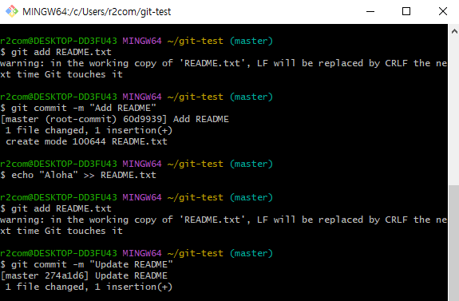
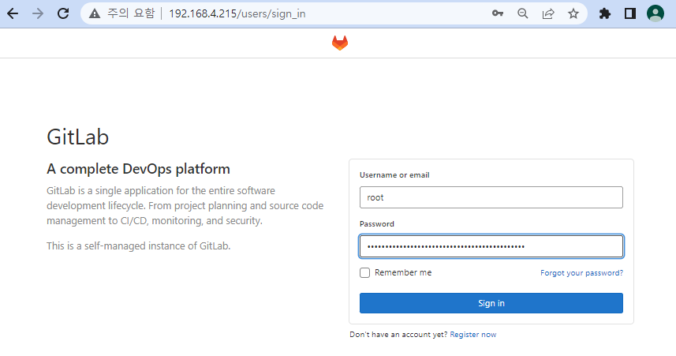
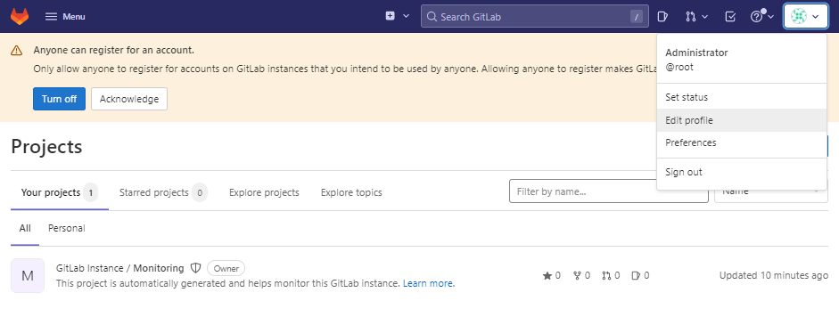
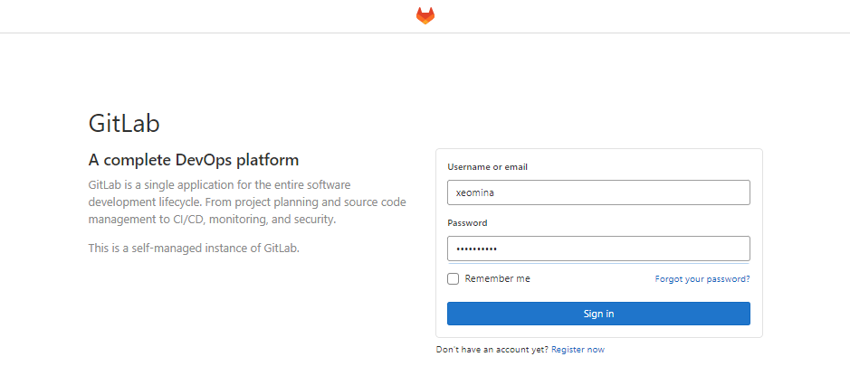

# 0726

# git

## git 설치

* **[64-bit Git for Windows Setup](https://github.com/git-for-windows/git/releases/download/v2.37.1.windows.1/Git-2.37.1-64-bit.exe).**


## Repository 생성

* `test-dev`


* 주소 복사

```
https://github.com/xeomina/test-dev.git
```


## CLI

```
$ mkdir git-test && cd $_
$ pwd
$ echo "Hello World" > README.txt
$ cat README.txt
Hello World
```


* git 초기화

```
$ git init
```

* user 설정

```
$ git config --global user.email "test@example.com"
$ git config --global user.name "xeomina"
```


* add & commit

```
$ git add README.txt
$ git commit -m "Add README"
$ echo "Aloha" >> README.txt
$ git add README.txt
$ git commit -m "Update README"
```



* log 

```
$ git log
```


* checkout

```
$ git checkout 60d993916fe455abf06fdf9f6352366d5b9346fa
```


* checkout -

```
$ git checkout -
```


## GitHub 원격저장소 연결

### Token 생성

* 원격저장소를 커밋할 때 자격증명 필요


* Settings


* Deveoper Settings


* Personal Access Tokens > Generate New Token


* Access Token 생성


* Personal Access Token 확인 및 복사


* Token 입력


### GitHub 원격저장소 커밋

```
$ git remote add origin https://github.com/xeomina/test-dev.git
$ git push origin master
```


### GitHub 원격저장소의 커밋을 로컬저장소에 내려받기

```
$ git clone https://github.com/xeomina/test-dev.git
$ ls test-dev/
$ cd test-dev/
$ echo "NIHAO" >> README.txt
$ git add README.txt
$ git commit -m "Update README2"
$ git push origin master
```


### 원격저장소의 새로운 커밋을 로컬저장소에 갱신하기

```
$ cd ~/git-test/
$ cat README.txt
$ git pull origin master
$ cat README.txt
```


* `README.txt` 제거

```
$ git rm README.txt
$ git commit -m "Delete README"
$ git push origin master
```


# Git Lab

## Git Lab 설치

* VM 생성 후
  * IP : 192.168.4.215

```
$ curl https://packages.gitlab.com/install/repositories/gitlab/gitlab-ce/script.rpm.sh | sudo bash
$ EXTERNAL_URL="http://192.168.4.215" yum install -y gitlab-ce
```

* password 확인

```
# cat /etc/gitlab/initial_root_password
Password: NkczFYK8vyp9bByzNXGcH4RjVMU0Pf29DEXk9K7uHEM=
```


* 192.168.4.215 접속
  * root 계정 로그인



* password 수정




* 다시 로그인


## 일반 사용자 생성

* 회원가입


* root 계정에서 admin


* users


* 사용자 승인


* Approve


* 일반 사용자 로그인



* role 선택


## 프로젝트 생성

* create a project


* create blank project


* test-project


* 생성 완료


# CI / CD

https://www.redhat.com/ko/topics/devops/what-is-ci-cd

