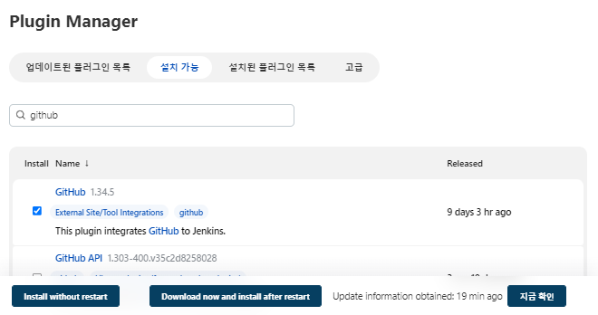

# 0727

# Jenkins

## AWS 인스턴스 생성

* jenkins-server
* 이미지 : AL2
* 유형 : t2.micro
* 키페어 : docker-key
* 네트워크 : MY-VPC
  * 서브넷 : 퍼블릭 2C

* 보안그룹 생성
  * DEV-SG
  * 포트 : SSH, HTTP, 사용자 지정 TCP (포트번호 8080-9000), 모든 ICMP - IPv4


## CLI

* root 사용자로 변경

```null
$ sudo su -
```

* 젠킨스 설치

```null
# wget -O /etc/yum.repos.d/jenkins.repo https://pkg.jenkins.io/redhat-stable/jenkins.repo
# rpm --import https://pkg.jenkins.io/redhat-stable/jenkins.io.key
# yum install -y fontconfig java-11-openjdk
# amazon-linux-extras install -y java-openjdk11
# yum install -y jenkins
# systemctl enable --now jenkins
# cat /var/lib/jenkins/secrets/initialAdminPassword
```


##  jenkins 접속


* password & timezone 설정


* 다시 로그인


## Project 생성

* 새로운 item 클릭


* `HelloWorldJob`
  * Freestyle


* 지금 빌드


## git hub 플러그인 설치

* git 설치

```
# yum install -y git
# hostnamectl set-hostname jenkins-server
# exit
$ sudo su -
```


* 젠킨스 관리 - 플러그인 관리


* git hub



* global tool 설정


* `default > git` 으로 이름 변경


## Project 생성

* `PullCodeFromGitHub`
  * Freestyle project


* 소스코드 관리 : Git
  * Repository URL : https://github.com/hali-linux/hello-world.git 


* 지금 빌드 및 콘솔 확인


* jenkins 워크스페이스 확인

```
# cd /var/lib/jenkins/workspace/
# ll
```


# maven

## maven 설치

- `apache-maven-3.8.6-bin.tar.gz` 버전 설치할 것
- 참고 링크 : https://maven.apache.org/install.html


```
# cd /opt
# wget https://dlcdn.apache.org/maven/maven-3/3.8.6/binaries/apache-maven-3.8.6-bin.tar.gz
# tar -xvzf apache-maven-3.8.6-bin.tar.gz
# mv apache-maven-3.8.6 maven
# cd maven
# cd bin
# ls
```

* `mvn` : 실행 파일


## 경로 설정

```
# find / -name java-11*
```


```
# vi .bash_profile

# .bash_profile

# Get the aliases and functions
if [ -f ~/.bashrc ]; then
        . ~/.bashrc
fi

M2_HOME=/opt/maven
M2=/opt/maven/bin
JAVA_HOME=/usr/lib/jvm/java-11-openjdk-11.0.13.0.8-1.amzn2.0.3.x86_64

# User specific environment and startup programs

PATH=$PATH:$HOME/bin:$JAVA_HOME:$M2_HOME:$M2

export PATH
```


* 확인

```
# echo $PATH
# source .bash_profile
# echo $PATH
# mvn -v
```


## maven 플러그인 설치

* Jenkins


## Global Tool Configuration

### JDK

* `java-11`
  * Install Automaticaly 체크 해제
  * JAVA_HOME=`/usr/lib/jvm/java-11-openjdk-11.0.13.0.8-1.amzn2.0.3.x86_64`


### Maven 

* `maven-3.8.6`
  * Install Automaticaly 체크 해제
  * MAVEN_HOME : `/opt/maven`


## Project 생성

- `FirstMavenProject`
  - MAVEN project


* 소스코드 : github 주소


- `POM.xml`
  - `.war` 파일 생성
    - 웹애플리케이션리소스 파일
  - `clean install`설정
    - 매번 생성하는 `.war` 파일을 지우고 다시 설치


* 빌드 완료


* CLI

```
# timedatectl set-timezone Asia/Seoul
```

```
# cd /var/lib/jenkins/workspace/FirstMavenProject/
# ll
```


* webapp이 `.war` 파일로 생성됨

```
# cd webapp/
# ls
# cd target
# ll
```


# tomcat

## AWS 인스턴스 생성

* tomcat-server
* 이미지 : AL2
* 유형 : t2.micro
* 키페어 : docker-key
* 네트워크 : MY-VPC
  * 서브넷 : 퍼블릭 2A
* 보안그룹 생성
  * DEV-SG
* 사용자 데이터 

```
#! /bin/bash
timedatectl set-timezone Asia/Seoul
```


* root 계정 진입 및 호스트 네임 바꿔주기

```
$ date
$ sudo su -
# hostnamectl set-hostname tomcat-server
# exit
$ sudo su -
```


## tomcat 설치

* 참고 사이트 : https://tomcat.apache.org/download-90.cgi


```
# amazon-linux-extras install -y java-openjdk11
# cd /opt
# wget https://dlcdn.apache.org/tomcat/tomcat-9/v9.0.65/bin/apache-tomcat-9.0.65.tar.gz
# tar -xvzf apache-tomcat-9.0.65.tar.gz
# mv apache-tomcat-9.0.65 tomcat
# cd tomcat/bin/
# ./startup.sh 			# tomcat 기동
```


## tomcat server 접속

* 3.38.246.169:8080


* 403 에러


* `context.xml` 파일 찾기

            # cd /opt/tomcat
            # find / -name context.xml


* Valve 부분을 주석처리

```
# vi /opt/tomcat/webapps/host-manager/META-INF/context.xml
<!--  <Valve className="org.apache.catalina.valves.RemoteAddrValve" allow="127\.\d+\.\d+\.\d+|::1|0:0:0:0:0:0:0:1" /> -->
```


```
# vi /opt/tomcat/webapps/manager/META-INF/context.xml
<!--  <Valve className="org.apache.catalina.valves.RemoteAddrValve"
       allow="127\.\d+\.\d+\.\d+|::1|0:0:0:0:0:0:0:1" /> -->
```


* 재접속


## 계정 정보 설정

*  `tomcat-users.xml` 파일

```
# vi /opt/tomcat/conf/tomcat-users.xml

## 하단에 아래 명령어 붙여넣기
<role rolename="manager-gui"/>
<role rolename="manager-script"/>
<role rolename="manager-jmx"/>
<role rolename="manager-status"/>
<user username="admin" password="as4914" roles="manager-gui, manager-script, manager-jmx, manager-status"/>
<user username="deployer" password="as4914" roles="manager-script"/> ## jenkins
<user username="tomcat" password="as4914" roles="manager-gui"/>
```


* tomcat start down 명령어 생성

```
# ln -s /opt/tomcat/bin/startup.sh /usr/local/bin/tomcatup
# ln -s /opt/tomcat/bin/shutdown.sh /usr/local/bin/tomcatdown
# tomcatdown
# tomcatup
```

* 다시 접속


* 웹 애플리케이션 매니저 페이지 확인


# Tomcat과 Jenkins 연결

## 플러그인 설치

* deploy to container


## credentials설정


* global 클릭


* add


* 위에서 설정한 `username`, `password` 기입


* 생성 확인


## Project 생성

* `BuildAndDeployJob`
  * MAVEN project


* 빌드 후 조치 추가


# 메가존 CTC 간담회        

## 클라우드 관련                                                                                                                                                                                                                          

**Edge Computing** - 초저지연, 초연결 -  extended reality

**멀티클라우드, 분산 클라우드**

-  서비스의 목표를 위한 다양한 환경 전략 수립 - paas, saas 솔루션을 통한 비즈니스 목표 달성(cloud native solutions, platform / ipaas - integration platform as a service)

- 제 1금융권 조직의 클라우드 서비스 도입 가속화 - IT 조직의 클라우드 비용 절약 - 다양한 플랫폼의 운영 단일화 / 실질적인 지출 비용 절약 

- Security - 복잡해지는 IT 환경에서의 일관된 보안 규정 준수

**인공지능 및 기계학습** - AI의 강화 AI Platform, AI engineering, Auto ML

- Smaer contact center - AICC, AI Contact Center - 보이는 콜 센터, chatbot을 넘어 callbot으로 - 인바운드/아웃바운드 자연어처리
- 초자동화(hyperautomation) - ML을 이용한 업무 품질 향상 - IT 프로세스의 자동화 - Generative AI (Low-code, No-code) 
- 데이터 분석을 통한 비즈니스 통찰력 확보 - Data lakehouse (data warehouse -> data lake -> data lakehouse) - databricks
- 자연어 처리를 통한 busniess intelligence - TX(Total experience), UX(User experience), CX(Customer Experience)... BX, EX...다양한 케이스에서 통찰력

**Blockchain** - NFT(non-fungible token)

## 채용 관련

**SA 직무 역할** : 아키텍처 설계 인프라 및 플랫폼 구축 마이그레이션 ....

**인재상** : 기술 지향 신뢰와 소통 고객 중심 실행을 통한 성장


