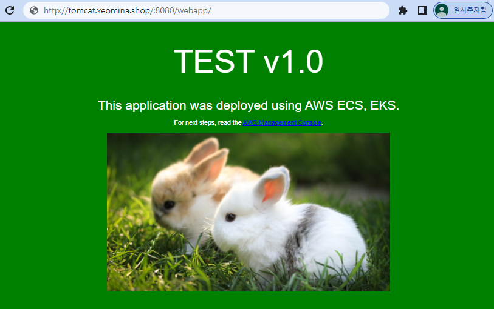

# 0728

## 레코드 수정


## git Repository URL 수정


* 빌드 확인




## git

```
$ git clone https://github.com/xeomina/hello-world.git
Cloning into 'hello-world'...
remote: Enumerating objects: 524, done.
remote: Total 524 (delta 0), reused 0 (delta 0), pack-reused 524
Receiving objects: 100% (524/524), 599.08 KiB | 5.55 MiB/s, done.
Resolving deltas: 100% (143/143), done.

r2com@DESKTOP-DD3FU43 MINGW64 ~
$ cd hello-world/

r2com@DESKTOP-DD3FU43 MINGW64 ~/hello-world (master)
$ ls
Dockerfile  pom.xml            regapp-service.yml  test.tml
README.md   regapp-deploy.yml  server/             webapp/

r2com@DESKTOP-DD3FU43 MINGW64 ~/hello-world (master)
$ cd webapp/

r2com@DESKTOP-DD3FU43 MINGW64 ~/hello-world/webapp (master)
$ ls
pom.xml  src/

r2com@DESKTOP-DD3FU43 MINGW64 ~/hello-world/webapp (master)
$ cd src/main/webapp/

r2com@DESKTOP-DD3FU43 MINGW64 ~/hello-world/webapp/src/main/webapp (master)
$ pwd
/c/Users/r2com/hello-world/webapp/src/main/webapp
```


## 수정해보기


```
$ vi index.jsp
$ git add index.jsp
$ git commit -m "update v2.0"
$ git push origin master
```


## 자동빌드 설정

* 자동으로 빌드 하게끔


* poll : 모니터링하기 위한..


* index 파일 수정


```
$ vi index.jsp

r2com@DESKTOP-DD3FU43 MINGW64 ~/hello-world/webapp/src/main/webapp (master)
$ git add index.jsp

r2com@DESKTOP-DD3FU43 MINGW64 ~/hello-world/webapp/src/main/webapp (master)
$ git commit -m "update v3.0"
[master 7694c94] update v3.0
 1 file changed, 1 insertion(+), 1 deletion(-)

r2com@DESKTOP-DD3FU43 MINGW64 ~/hello-world/webapp/src/main/webapp (master)
$ git push origin master
```


## 웹페이지 꾸미기


* `tar` 파일 압축해제

```
$ ls
$ tar -xvf gcp.tar
$ ls
```


* 

```
$ mv index.jsp index.jsp.bak
$ mv index.html index.jsp
$ ls
```


*

```
$ git add .
$ git commit -m "Update web-page"
$ git push origin master
```


* 빌드 확인


## EC2 AL2 GitLab 설치

* https://about.gitlab.com/install/#amazonlinux-2


1. Install and configure the necessary dependencies

```
# sudo yum install -y curl policycoreutils-python openssh-server openssh-clients perl
```

2. Add the GitLab package repository and install the package

```
# curl https://packages.gitlab.com/install/repositories/gitlab/gitlab-ce/script.rpm.sh | sudo bash
# sudo sed -i "s/\/el\/7/\/amazon\/2/g" /etc/yum.repos.d/gitlab_gitlab*.repo
# sudo yum clean metadata
# sudo yum makecache
```

* `tomcat.xeomina.shop`으로만 GitLab 인스턴스에 접근 가능하도록 설정

```
# sudo EXTERNAL_URL="http://tomcat.xeomina.shop" yum install -y gitlab-ce
```


* 진행 불가.... GCP로!


## GCP GitLab 


* key 생성

```
>ssh-keygen -t rsa
```


* SSH키에 `id_rsa.pub` 복사붙여넣기


* ssh 접속

