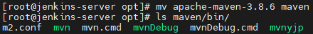

# 0729

* CI /CD 흐름


- CI : git - maven
- CD : jenkins - tomcat 


## GitLab

### Create new project


### 원격 저장소 마이그레이션

> Github에서 Gitlab으로..

* `github` migration

```
$ mkdir git-migration
$ git clone --mirror https://github.com/xeomina/hello-world.git git-migration
$ cd git-migration/
$ ls
```


* branch 생성
  * master


* clone

```
http://gitlab.xeomina.shop/xeomina/dev-site.git
```


* push

```
$ git push -uf http://gitlab.xeomina.shop/xeomina/dev-site --all
```


## Jenkins

### AWS EC2 인스턴스 생성

* `jenkins-server`
* 사용자 데이터

```
#! /bin/bash
timedatectl set-timezone Asia/Seoul
```


### Jenkins 설치

*  jenkins 저장소 추가

```
$ sudo su -		# root 계정으로
# wget -O /etc/yum.repos.d/jenkins.repo https://pkg.jenkins.io/redhat-stable/jenkins.repo
```

* key 추가

````
# rpm --import https://pkg.jenkins.io/redhat-stable/jenkins.io.key
````

* `java` 및 `fontconfig` 설치
  * AL2에는 `java-11-openjdk` 대신 `java-openjdk11` 설치

```
# yum install -y fontconfig java-11-openjdk
# amazon-linux-extras install -y java-openjdk11
```


* `git` 설치

```
# hostnamectl set-hostname jenkins-server
# yum install -y git
```

* `jenkins` 설치

```
# yum install -y jenkins
# systemctl enable --now jenkins
# cat /var/lib/jenkins/secrets/initialAdminPassword
0134779d86c740bdb50cc9ee123dbc4b
```

* 포트번호 확인
  * 8080

```
# ss -nat
```


### Jenkins 접속

* `jenkins.xeomina.shop:8080`


* x 클릭


* Start Jenkins


* password 변경 및 timezone 설정


* Apply > Save


* 다시 로그인


### Create Project

* `HelloWorldJob`
  * 플러그인 설치 전에는 `Freestyle project` ..


* Build


###  Plugin

* `GitLab` 플러그인 설치


* Global Tool Configuration


### Create Project

* `PullCodeFromGitLab`


* 소스 코드 관리

```
http://gitlab.xeomina.shop/xeomina/dev-site.git
```


* Build


* 연결 확인

```
# cd /var/lib/jenkins/workspace/PullCodeFromGitLab/
# ll
```


## Maven

### Maven 설치

* `-xvzf` : extrack view zip file

```
# cd /opt
# wget https://dlcdn.apache.org/maven/maven-3/3.8.6/binaries/apache-maven-3.8.6-bin.tar.gz
# tar -xvzf apache-maven-3.8.6-bin.tar.gz
```

* `mvn` : 실행 파일

```
# mv apache-maven-3.8.6 maven	# 이름 바꾸기
# ls maven/bin/
```



### 경로 설정

* JAVA 찾기

```
# find / -name java-11*
```


* 환경변수 설정
  * `jenkins`가 어디서든 `maven` 실행 가능하도록

```
# vi .bash_profile
# .bash_profile

# Get the aliases and functions
if [ -f ~/.bashrc ]; then
        . ~/.bashrc
fi

M2_HOME=/opt/maven
M2=/opt/maven/bin
JAVA_HOME=/usr/lib/jvm/java-11-openjdk-11.0.13.0.8-1.amzn2.0.3.x86_64

# User specific environment and startup programs

PATH=$PATH:$HOME/bin:$JAVA_HOME:$M2_HOME:$M2

export PATH
```


* 경로 적용 및 확인

```
# source .bash_profile
# echo $PATH
# mvn -v
```


### Plugin

* Plugin Manager


### Global Tool Configuration

* JDK
  * `java-11`
  * Install Automaticaly 체크 해제
  * JAVA_HOME=`/usr/lib/jvm/java-11-openjdk-11.0.13.0.8-1.amzn2.0.3.x86_64`


* Maven 
  * `maven-3.8.6`
  * Install Automaticaly 체크 해제
  * MAVEN_HOME : `/opt/maven`


### Create Project

* `FirstMavenProject`
  * Maven Project


* 빌드 확인


* 워크스페이스 확인

```
# cd /var/lib/jenkins/workspace/FirstMavenProject
# ll
```

