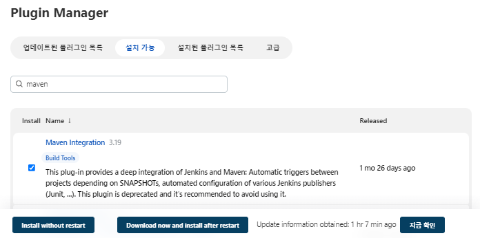
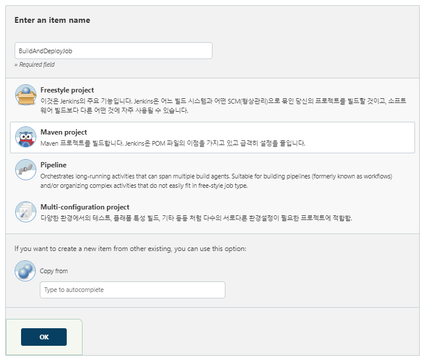
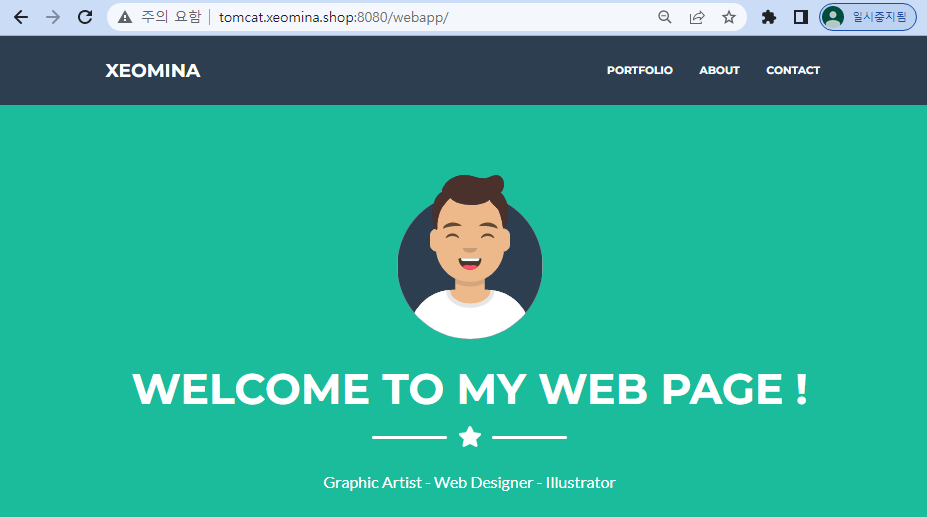
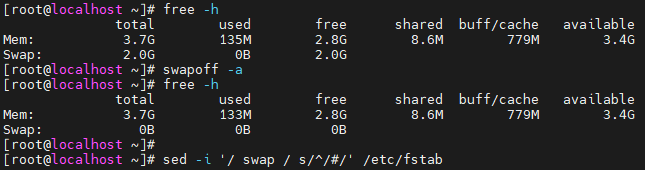
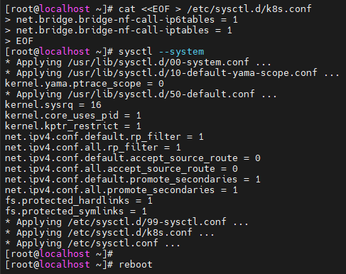

# 0729

# CI /CD

* CI /CD 흐름


- CI : git - maven
- CD : jenkins - tomcat 


## GitLab

### Create new project


### 원격 저장소 마이그레이션

> Github에서 Gitlab으로..

* `github` migration

```
$ mkdir git-migration
$ git clone --mirror https://github.com/xeomina/hello-world.git git-migration
$ cd git-migration/
$ ls
```


* branch 생성
  * master


* clone

```
http://gitlab.xeomina.shop/xeomina/dev-site.git
```


* push

```
$ git push -uf http://gitlab.xeomina.shop/xeomina/dev-site --all
```


## Jenkins

### AWS EC2 인스턴스 생성

* `jenkins-server`
  * 이미지 : AL2
  * 유형 : t2.micro
  * 키페어 : docker-key
  * 네트워크 : MY-PUBLIC-SUBNET-2A
  * 보안그룹 : DEV-SG
  * 사용자 데이터


```
#! /bin/bash
timedatectl set-timezone Asia/Seoul
```


### Jenkins 설치

* hostname 설정

```
# hostnamectl set-hostname jenkins-server
```

*  jenkins 저장소 추가

```
$ sudo su -		# root 계정으로
# wget -O /etc/yum.repos.d/jenkins.repo https://pkg.jenkins.io/redhat-stable/jenkins.repo
```

* key 추가

````
# rpm --import https://pkg.jenkins.io/redhat-stable/jenkins.io.key
````

* `java` 및 `fontconfig` 설치
  * AL2에는 `java-11-openjdk` 대신 `java-openjdk11` 설치

```
# yum install -y fontconfig java-11-openjdk
# amazon-linux-extras install -y java-openjdk11
```


* `git` 설치

```
# yum install -y git
```

* `jenkins` 설치

```
# yum install -y jenkins
# systemctl enable --now jenkins
# cat /var/lib/jenkins/secrets/initialAdminPassword
0134779d86c740bdb50cc9ee123dbc4b
```

* 포트번호 확인
  * 8080

```
# ss -nat
```


### Jenkins 접속

* `jenkins.xeomina.shop:8080`


* x 클릭


* Start Jenkins


* password 변경 및 timezone 설정


* Apply > Save


* 다시 로그인


### Create Project

* `HelloWorldJob`
  * 플러그인 설치 전에는 `Freestyle project` ..


* Build


###  Plugin

* `GitLab` 플러그인 설치


* Global Tool Configuration


### Create Project

* `PullCodeFromGitLab`


* 소스 코드 관리

```
http://gitlab.xeomina.shop/xeomina/dev-site.git
```


* Build


* 연결 확인

```
# cd /var/lib/jenkins/workspace/PullCodeFromGitLab/
# ll
```


## Maven

### Maven 설치

* Maven 버전 확인
  * https://maven.apache.org/install.html
* `-xvzf` : extrack view zip file

```
# cd /opt
# wget https://dlcdn.apache.org/maven/maven-3/3.8.6/binaries/apache-maven-3.8.6-bin.tar.gz
# tar -xvzf apache-maven-3.8.6-bin.tar.gz
```

* `mvn` : 실행 파일

```
# mv apache-maven-3.8.6 maven	# 이름 바꾸기
# ls maven/bin/
```


### 경로 설정

* JAVA 찾기

```
# find / -name java-11*
```


* 환경변수 설정
  * `jenkins`가 어디서든 `maven` 실행 가능하도록

```
# vi .bash_profile
# .bash_profile

# Get the aliases and functions
if [ -f ~/.bashrc ]; then
        . ~/.bashrc
fi

M2_HOME=/opt/maven
M2=/opt/maven/bin
JAVA_HOME=/usr/lib/jvm/java-11-openjdk-11.0.13.0.8-1.amzn2.0.3.x86_64

# User specific environment and startup programs

PATH=$PATH:$HOME/bin:$JAVA_HOME:$M2_HOME:$M2

export PATH
```


* 경로 적용 및 확인

```
# source .bash_profile
# echo $PATH
# mvn -v
```


### Plugin

* Plugin Manager




### Global Tool Configuration

* JDK
  * `java-11`
  * Install Automaticaly 체크 해제
  * JAVA_HOME=`/usr/lib/jvm/java-11-openjdk-11.0.13.0.8-1.amzn2.0.3.x86_64`


* Maven 
  * `maven-3.8.6`
  * Install Automaticaly 체크 해제
  * MAVEN_HOME : `/opt/maven`


### Create Project

* `FirstMavenProject`
  * Maven Project


* 빌드 확인


* 워크스페이스 확인

```
# cd /var/lib/jenkins/workspace/FirstMavenProject
# ll
```


## Tomcat

### AWS EC2 인스턴스 생성

* `tomcat-server`
  * 이미지 : AL2
  * 유형 : t2.micro
  * 키페어 : docker-key
  * 네트워크 : MY-PUBLIC-SUBNET-2A
  * 보안그룹 : DEV-SG
  * 사용자 데이터

```
#! /bin/bash
timedatectl set-timezone Asia/Seoul
```


### Tomcat 설치

* hostname 변경

```
$ sudo su -		# root 계정으로
# hostnamectl set-hostname tomcat-server
```

* java 설치

```
# amazon-linux-extras install -y java-openjdk11
```

* tomcat 설치
  * tomcat 버전 확인 : https://tomcat.apache.org/download-90.cgi

```
# cd /opt
# wget https://dlcdn.apache.org/tomcat/tomcat-9/v9.0.65/bin/apache-tomcat-9.0.65.tar.gz
# tar -xvzf apache-tomcat-9.0.65.tar.gz
```

* `startup.sh` : tomcat 실행파일

```
# mv apache-tomcat-9.0.65 tomcat
# cd tomcat/bin/
# ls
# ./startup.sh
```


* 포트 확인
  * 8080

```
# ./startup.sh
```


### Tomcat 접속

* `tomcat.xeomina.shop:8080`


* Manager App
  * 403 에러 - 로컬만 접근 허용


### 

* `context.xml` 파일 찾기

```
# cd /opt/tomcat
# find / -name context.xml
```


* `context.xml` 파일 수정
  * 접근 허용 정보 `<Valve>` : 주석처리

```
# vi /opt/tomcat/webapps/host-manager/META-INF/context.xml
<!--  <Valve className="org.apache.catalina.valves.RemoteAddrValve"
         allow="127\.\d+\.\d+\.\d+|::1|0:0:0:0:0:0:0:1" /> -->
```


```
# vi /opt/tomcat/webapps/manager/META-INF/context.xml
<!--  <Valve className="org.apache.catalina.valves.RemoteAddrValve"
         allow="127\.\d+\.\d+\.\d+|::1|0:0:0:0:0:0:0:1" /> -->
```


* 다시 접속


* `tomcat-users.xml` 파일 수정

```
# cd /opt/tomcat/conf
# vi /opt/tomcat/conf/tomcat-users.xml
<role rolename="manager-gui"/>
<role rolename="manager-script"/>
<role rolename="manager-jmx"/>
<role rolename="manager-status"/>
<user username="admin" password="as4914" roles="manager-gui, manager-script, manager-jmx, manager-status"/>
<user username="deployer" password="as4914" roles="manager-script"/>
<user username="tomcat" password="as4914" roles="manager-gui"/>
```


### Plugin

* deploy to container


### Manage Credentials


* global


* add credentials


* tomcat_deployer


### Create Project




* 빌드


## Git Bash

### clone

* 특정 branch : `master`

```
$ git clone -b master http://gitlab.xeomina.shop/xeomina/dev-site.git
$ cd dev-site/webapp/src/main/webapp/
$ ls
```


### webpage 수정해보기

```
$ vi index.jsp
```


```
$ git commit -m "Update webpage"
$ git add .
$ git status
$ git commit -m "Update webpage"
$ git push origin master
```


### Jenkins에서 수동 빌드


* webapp 접속


### 자동 빌드 설정


### webpage 수정해보기

```
$ vi index.jsp
```


```
$ git add .
$ git commit -m "Update header"
$ git push origin master
```


* 자동으로 빌드


* 웹페이지 접속




# Kubernetes

## VM 생성

* master 최소 사양
  * CPU : 2C
  * RAM : 4G (4096MB)
  * NET : NAT (송신전용) / Host-Only (수신전용)

## VM 접속

* ip 확인
  * 192.168.56.108
* docker repo 설치

```
# curl https://download.docker.com/linux/centos/docker-ce.repo -o /etc/yum.repos.d/docker-ce.repo
# sed -i -e "s/enabled=1/enabled=0/g" /etc/yum.repos.d/docker-ce.repo
# yum --enablerepo=docker-ce-stable -y install docker-ce-19.03.15-3.el7
```

* docker 설치

```
# mkdir /etc/docker			# 없으면 x
# cat <<EOF | sudo tee /etc/docker/daemon.json
{
  "exec-opts": ["native.cgroupdriver=systemd"],
  "log-driver": "json-file",
  "log-opts": {
    "max-size": "100m"
  },
  "storage-driver": "overlay2"
}
EOF
```


* swap 메모리 비활성화
  * kubernetes에서 현재 지원 x
  * `fstab` : 디스크 관련

```
# swapoff -a
# free -h
# sed -i '/ swap / s/^/#/' /etc/fstab	# 영구적으로 swapoff
```



* `k8s.conf` 파일 설정
  * [iptables가 브리지된 트래픽을 보게 하기](https://kubernetes.io/ko/docs/setup/production-environment/tools/_print/#iptables%EA%B0%80-%EB%B8%8C%EB%A6%AC%EC%A7%80%EB%90%9C-%ED%8A%B8%EB%9E%98%ED%94%BD%EC%9D%84-%EB%B3%B4%EA%B2%8C-%ED%95%98%EA%B8%B0)

```
# cat <<EOF > /etc/sysctl.d/k8s.conf
net.bridge.bridge-nf-call-ip6tables = 1
net.bridge.bridge-nf-call-iptables = 1
EOF

# sysctl --system
# reboot
```



* `kubernetes repo` 설정
  * 참조할 저장소

```
# cat <<'EOF' > /etc/yum.repos.d/kubernetes.repo
[kubernetes]
name=Kubernetes
baseurl=https://packages.cloud.google.com/yum/repos/kubernetes-el7-$basearch
enabled=1
gpgcheck=0
repo_gpgcheck=0
gpgkey=https://packages.cloud.google.com/yum/doc/yum-key.gpg https://packages.cloud.google.com/yum/doc/rpm-package-key.gpg
EOF
```

* kubernetes 패키지 설치
  * [kubeadm, kubelet 및 kubectl 설치](https://kubernetes.io/ko/docs/setup/production-environment/tools/_print/#kubeadm-kubelet-%EB%B0%8F-kubectl-%EC%84%A4%EC%B9%98)
  * `kubeadm`: 클러스터를 부트스트랩하는 명령
  * `kubelet`: 클러스터의 모든 머신에서 실행되는 파드와 컨테이너 시작과 같은 작업을 수행하는 컴포넌트
  * `kubectl`: 클러스터와 통신하기 위한 커맨드 라인 유틸리티

```
# yum -y install kubeadm-1.19.16-0 kubelet-1.19.16-0 kubectl-1.19.16-0 --disableexcludes=kubernetes
# systemctl enable kubelet
```

