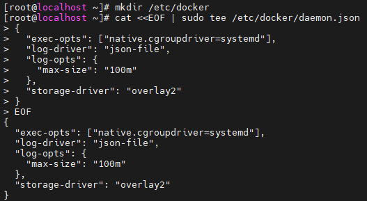
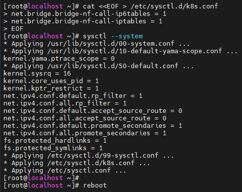
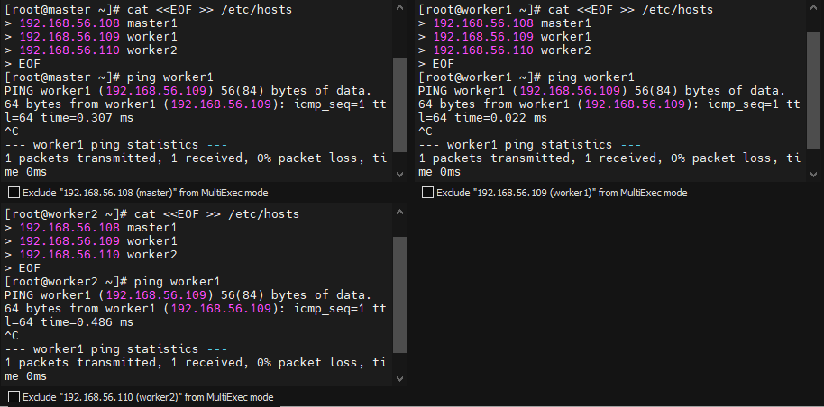
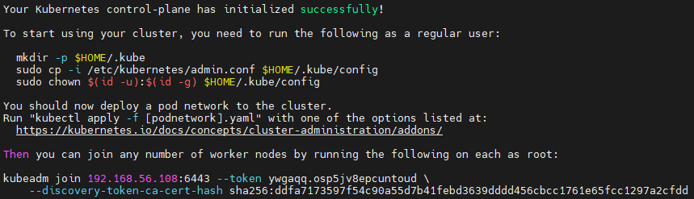
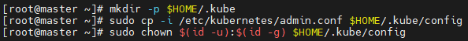
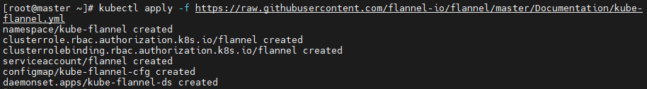
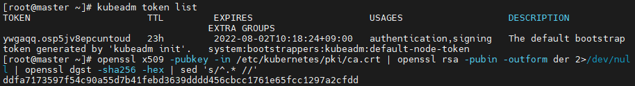
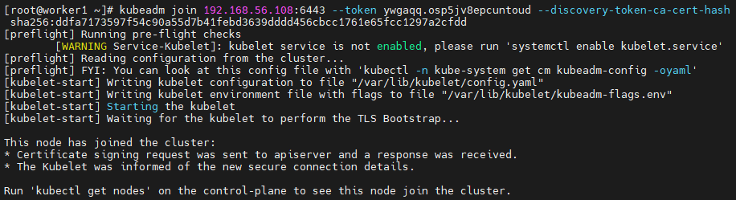
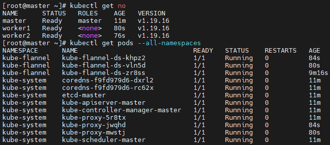

# 0801

# Kubernetes

## VM 생성

* master 최소 사양
  * CPU : 2C
  * RAM : 4G (4096MB)
  * NET : NAT (송신전용) / Host-Only (수신전용)

## VM 접속

* ip 확인
  * 192.168.56.108
* docker repo 설치

```
# curl https://download.docker.com/linux/centos/docker-ce.repo -o /etc/yum.repos.d/docker-ce.repo
# sed -i -e "s/enabled=1/enabled=0/g" /etc/yum.repos.d/docker-ce.repo
# yum --enablerepo=docker-ce-stable -y install docker-ce-19.03.15-3.el7
```

* docker 설치

```
# mkdir /etc/docker			# 없으면 x
# cat <<EOF | sudo tee /etc/docker/daemon.json
{
  "exec-opts": ["native.cgroupdriver=systemd"],
  "log-driver": "json-file",
  "log-opts": {
    "max-size": "100m"
  },
  "storage-driver": "overlay2"
}
EOF
```



* docker 설정

```
# systemctl enable --now docker
# systemctl daemon-reload
# systemctl restart docker
# systemctl disable --now firewalld
# setenforce 0
# sed -i 's/^SELINUX=enforcing$/SELINUX=disabled/' /etc/selinux/config
```


* swap 메모리 비활성화
  * kubernetes에서 현재 지원 x
  * `fstab` : 디스크 관련

```
# swapoff -a
# free -h
# sed -i '/ swap / s/^/#/' /etc/fstab	# 영구적으로 swapoff
```


* `k8s.conf` 파일 설정
  * [iptables가 브리지된 트래픽을 보게 하기](https://kubernetes.io/ko/docs/setup/production-environment/tools/_print/#iptables%EA%B0%80-%EB%B8%8C%EB%A6%AC%EC%A7%80%EB%90%9C-%ED%8A%B8%EB%9E%98%ED%94%BD%EC%9D%84-%EB%B3%B4%EA%B2%8C-%ED%95%98%EA%B8%B0)

```
# cat <<EOF > /etc/sysctl.d/k8s.conf
net.bridge.bridge-nf-call-ip6tables = 1
net.bridge.bridge-nf-call-iptables = 1
EOF

# sysctl --system
# reboot
```



* `kubernetes repo` 설정
  * 참조할 저장소

```
# cat <<'EOF' > /etc/yum.repos.d/kubernetes.repo
[kubernetes]
name=Kubernetes
baseurl=https://packages.cloud.google.com/yum/repos/kubernetes-el7-$basearch
enabled=1
gpgcheck=0
repo_gpgcheck=0
gpgkey=https://packages.cloud.google.com/yum/doc/yum-key.gpg https://packages.cloud.google.com/yum/doc/rpm-package-key.gpg
EOF
```

* kubernetes 패키지 설치
  * [kubeadm, kubelet 및 kubectl 설치](https://kubernetes.io/ko/docs/setup/production-environment/tools/_print/#kubeadm-kubelet-%EB%B0%8F-kubectl-%EC%84%A4%EC%B9%98)
  * `kubeadm`: 클러스터를 부트스트랩하는 명령
  * `kubelet`: 클러스터의 모든 머신에서 실행되는 파드와 컨테이너 시작과 같은 작업을 수행하는 컴포넌트
  * `kubectl`: 클러스터와 통신하기 위한 커맨드 라인 유틸리티

```
# yum -y install kubeadm-1.19.16-0 kubelet-1.19.16-0 kubectl-1.19.16-0 --disableexcludes=kubernetes
# systemctl enable kubelet
```


* VM 복제..
  * master : 2C, 4G
  * worker1, worker2 : 1C, 1G


* ip 확인
  * master1 : 192.168.56.108
  * worker1 : 192.168.56.109
  * worker2 : 192.168.56.110


## All Node
```cat <<EOF >> /etc/hosts
# cat <<EOF >> /etc/hosts
192.168.56.108 master1
192.168.56.109 worker1
192.168.56.110 worker2
EOF
# systemctl enable --now docker
```



## master

*

```
# systemctl enable --now docker
# kubeadm init --apiserver-advertise-address=192.168.56.108 --pod-network-cidr=10.244.0.0/16
```



```
# mkdir -p $HOME/.kube
# cp -i /etc/kubernetes/admin.conf $HOME/.kube/config
# chown $(id -u):$(id -g) $HOME/.kube/config
```



*

````
# kubectl apply -f https://raw.githubusercontent.com/flannel-io/flannel/master/Documentation/kube-flannel.yml
````



* 토큰 리스트 확인

```
# kubeadm token list
```

* 마스터의 Hash 값 확인

````
# openssl x509 -pubkey -in /etc/kubernetes/pki/ca.crt | openssl rsa -pubin -outform der 2>/dev/null | openssl dgst -sha256 -hex | sed 's/^.* //'
````



* 워커노드 join
  * `kubeadm join [마스터노드IP]:6443 --token [Token값] --discovery-token-ca-cert-hash sha256:[Hash 값]`

```
# kubeadm join 192.168.56.108:6443 --token ywgaqq.osp5jv8epcuntoud --discovery-token-ca-cert-hash sha256:ddfa7173597f54c90a55d7b41febd3639dddd456cbcc1761e65fcc1297a2cfdd
```



* 노드 확인

```
# kubectl get pods --all-namespaces
```



* 자동완성

```
# source <(kubectl completion bash)
# echo "source <(kubectl completion bash)" >> ~/.bashrc
# exit
```

