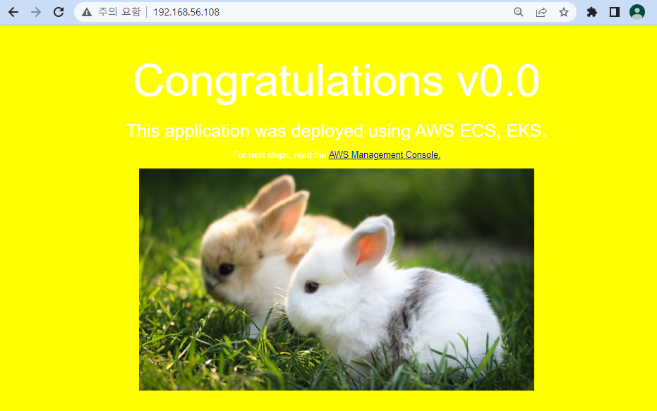
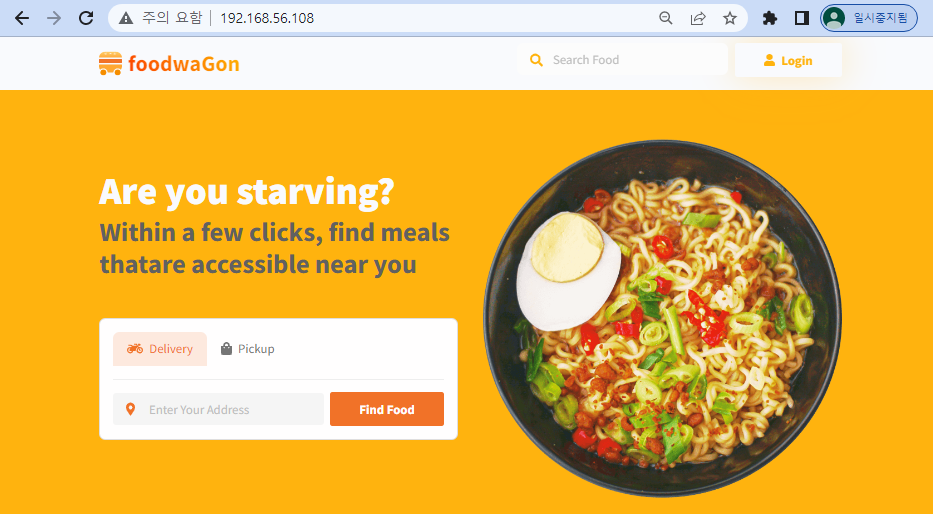

# 0801

# Kubernetes

## VM 생성

* master 최소 사양
  * CPU : 2C
  * RAM : 4G (4096MB)
  * NET : NAT (송신전용) / Host-Only (수신전용)

* ip 확인 : 192.168.56.108


## Docker 설치

* [Install Docker Engine on CentOS](https://docs.docker.com/engine/install/centos/)

* docker repo 설치

```
# curl https://download.docker.com/linux/centos/docker-ce.repo -o /etc/yum.repos.d/docker-ce.repo
# sed -i -e "s/enabled=1/enabled=0/g" /etc/yum.repos.d/docker-ce.repo
# yum --enablerepo=docker-ce-stable -y install docker-ce-19.03.15-3.el7
```

* docker 설치

```
# mkdir /etc/docker			# 없으면 x
# cat <<EOF | sudo tee /etc/docker/daemon.json
{
  "exec-opts": ["native.cgroupdriver=systemd"],
  "log-driver": "json-file",
  "log-opts": {
    "max-size": "100m"
  },
  "storage-driver": "overlay2"
}
EOF
```


* docker 설정

```
# systemctl enable --now docker
# systemctl daemon-reload
# systemctl restart docker
# systemctl disable --now firewalld
# setenforce 0
# sed -i 's/^SELINUX=enforcing$/SELINUX=disabled/' /etc/selinux/config
```


* swap 메모리 비활성화
  * kubernetes에서 현재 지원 x
  * `fstab` : 디스크 관련

```
# swapoff -a
# free -h
# sed -i '/ swap / s/^/#/' /etc/fstab	# 영구적으로 swapoff
```


* `k8s.conf` 파일 설정
  * [iptables가 브리지된 트래픽을 보게 하기](https://kubernetes.io/ko/docs/setup/production-environment/tools/_print/#iptables%EA%B0%80-%EB%B8%8C%EB%A6%AC%EC%A7%80%EB%90%9C-%ED%8A%B8%EB%9E%98%ED%94%BD%EC%9D%84-%EB%B3%B4%EA%B2%8C-%ED%95%98%EA%B8%B0)

```
# cat <<EOF > /etc/sysctl.d/k8s.conf
net.bridge.bridge-nf-call-ip6tables = 1
net.bridge.bridge-nf-call-iptables = 1
EOF

# sysctl --system
# reboot
```


* `kubernetes repo` 설정
  * 참조할 저장소

```
# cat <<'EOF' > /etc/yum.repos.d/kubernetes.repo
[kubernetes]
name=Kubernetes
baseurl=https://packages.cloud.google.com/yum/repos/kubernetes-el7-$basearch
enabled=1
gpgcheck=0
repo_gpgcheck=0
gpgkey=https://packages.cloud.google.com/yum/doc/yum-key.gpg https://packages.cloud.google.com/yum/doc/rpm-package-key.gpg
EOF
```

* kubernetes 패키지 설치
  * [kubeadm, kubelet 및 kubectl 설치](https://kubernetes.io/ko/docs/setup/production-environment/tools/_print/#kubeadm-kubelet-%EB%B0%8F-kubectl-%EC%84%A4%EC%B9%98)
  * `kubeadm`: 클러스터를 부트스트랩하는 명령
  * `kubelet`: 클러스터의 모든 머신에서 실행되는 파드와 컨테이너 시작과 같은 작업을 수행하는 컴포넌트
  * `kubectl`: 클러스터와 통신하기 위한 커맨드 라인 유틸리티

```
# yum -y install kubeadm-1.19.16-0 kubelet-1.19.16-0 kubectl-1.19.16-0 --disableexcludes=kubernetes
# systemctl enable kubelet
```


## worker 노드 생성

* VM 복제..
  * master : 2C, 4G
  * worker1, worker2 : 1C, 1G


* ip 확인
  * master1 : 192.168.56.108
  * worker1 : 192.168.56.109
  * worker2 : 192.168.56.110


## All Node
```cat <<EOF >> /etc/hosts
# cat <<EOF >> /etc/hosts
192.168.56.108 master1
192.168.56.109 worker1
192.168.56.110 worker2
EOF
```


## master

* `initializes a Kubernetes control-plane node`

```
# kubeadm init --apiserver-advertise-address=192.168.56.108 --pod-network-cidr=10.244.0.0/16
```


```
# mkdir -p $HOME/.kube
# cp -i /etc/kubernetes/admin.conf $HOME/.kube/config
# chown $(id -u):$(id -g) $HOME/.kube/config
```


*

````
# kubectl apply -f https://raw.githubusercontent.com/flannel-io/flannel/master/Documentation/kube-flannel.yml
````


* 토큰 리스트 확인

```
# kubeadm token list
```

* 마스터의 Hash 값 확인

````
# openssl x509 -pubkey -in /etc/kubernetes/pki/ca.crt | openssl rsa -pubin -outform der 2>/dev/null | openssl dgst -sha256 -hex | sed 's/^.* //'
````


* 워커노드 join
  * `kubeadm join [마스터노드IP]:6443 --token [Token값] --discovery-token-ca-cert-hash sha256:[Hash 값]`

```
# kubeadm join 192.168.56.108:6443 --token ywgaqq.osp5jv8epcuntoud --discovery-token-ca-cert-hash sha256:ddfa7173597f54c90a55d7b41febd3639dddd456cbcc1761e65fcc1297a2cfdd
```


* 노드 확인

```
# kubectl get pods --all-namespaces
```


* 자동완성

```
# source <(kubectl completion bash)
# echo "source <(kubectl completion bash)" >> ~/.bashrc
# exit
```


*

```
# kubectl version
```


## Ingress

* git에서 `nginx` 써드파티에서 controller 불러오기 ?

```
# yum install -y git
# git clone https://github.com/hali-linux/_Book_k8sInfra.git
```

* `ingress-nginx.yaml` 파일 appy

```
# kubectl apply -f /root/_Book_k8sInfra/ch3/3.3.2/ingress-nginx.yaml
# kubectl get po -n ingress-nginx
```


*

```
# mkdir ingress && cd $_
# vi ingress-deploy.yaml
apiVersion: apps/v1
kind: Deployment
metadata:
  name: foods-deploy
spec:
  replicas: 1
  selector:
    matchLabels:
      app: foods-deploy
  template:
    metadata:
      labels:
        app: foods-deploy
    spec:
      containers:
      - name: foods-deploy
        image: halilinux/test-home:v1.0
---
apiVersion: v1
kind: Service
metadata:
  name: foods-svc
spec:
  type: ClusterIP
  selector:
    app: foods-deploy
  ports:
  - protocol: TCP
    port: 80
    targetPort: 80
---
apiVersion: apps/v1
kind: Deployment
metadata:
  name: sales-deploy
spec:
  replicas: 1
  selector:
    matchLabels:
      app: sales-deploy
  template:
    metadata:
      labels:
        app: sales-deploy
    spec:
      containers:
      - name: sales-deploy
        image: halilinux/test-home:v2.0
---
apiVersion: v1
kind: Service
metadata:
  name: sales-svc
spec:
  type: ClusterIP
  selector:
    app: sales-deploy
  ports:
  - protocol: TCP
    port: 80
    targetPort: 80
---
apiVersion: apps/v1
kind: Deployment
metadata:
  name: home-deploy
spec:
  replicas: 1
  selector:
    matchLabels:
      app: home-deploy
  template:
    metadata:
      labels:
        app: home-deploy
    spec:
      containers:
      - name: home-deploy
        image: halilinux/test-home:v0.0
---
apiVersion: v1
kind: Service
metadata:
  name: home-svc
spec:
  type: ClusterIP
  selector:
    app: home-deploy
  ports:
  - protocol: TCP
    port: 80
    targetPort: 80
```


* apply

```
# kubectl apply -f ingress-deploy.yaml
# kubectl get all
```


* Cluster IP 확인

````
# curl 10.107.120.179
# curl 10.105.154.189
# curl 10.105.120.236
````


----

**Cf) ip 확인해보기**

* network 확인

```
# docker network list
```


* pod 접속

```
# kubectl get po
# kubectl exec -it foods-deploy-7ffcb8f58-cvv2c -- bash
```


* ip 확인
  * pod의 ip

```
# apt update
# apt install -y net-tools
# ifconfig
```


----


* `ingress-config.yaml` 파일 생성

```
# vi ingress-config.yaml
apiVersion: networking.k8s.io/v1beta1
kind: Ingress
metadata:
  name: ingress-nginx
  annotations:		 # 주석 = 설명
    nginx.ingress.kubernetes.io/rewrite-target: / 		# = http://abc.com/foods, /sales, /
spec:
  rules:
  - http:
      paths:
      - path: /foods
        backend:	# TargetGroup
          serviceName: foods-svc	# Service: ClusterIP
          servicePort: 80
      - path: /sales
        backend:
          serviceName: sales-svc
          servicePort: 80
      - path:
        backend:
          serviceName: home-svc
          servicePort: 80
```


* apply

```
# kubectl apply -f ingress-config.yaml
# kubectl get ingress
# kubectl describe ingress ingress-nginx
```


* `ingress-service.yaml` 파일 생성
  * `LoadBalancer` : 내부 및 외부 ingress의 가교 역할

```
# vi ingress-service.yaml
apiVersion: v1
kind: Service
metadata:
  name: nginx-ingress-controller
  namespace: ingress-nginx
spec:
  ports:
  - name: http
    protocol: TCP
    port: 80
    targetPort: 80
  - name: https
    protocol: TCP
    port: 443
    targetPort: 443
  selector:
    app.kubernetes.io/name: ingress-nginx
  type: LoadBalancer
  externalIPs:
  - 192.168.56.108
```


* apply

```
# vi ingress-service.yaml
# kubectl apply -f ingress-service.yaml
# kubectl get svc
# kubectl get svc -n ingress-nginx
```


* 웹 브라우저 접속




* `ingress-deploy.yaml` 수정
  * `foods-deploy`, `home-deploy`의 image : `food`로 수정
  * home까지 바꾸는 이유 : 경로 문제

```
# vi ingress-deploy.yaml
apiVersion: apps/v1
kind: Deployment
metadata:
  name: foods-deploy
  ...
    spec:
      containers:
      - name: foods-deploy
        image: halilinux/food:v1.0	    # 수정
---
apiVersion: apps/v1
kind: Deployment
metadata:
  name: home-deploy
  ...
    spec:
      containers:
      - name: home-deploy
        image: halilinux/food:v1.0		# 수정
```

* apply

```
# vi ingress-deploy.yaml
# kubectl apply -f ingress-deploy.yaml
# kubectl get po
```


* 웹 접속




## Taint

* taint

```
# kubectl taint no worker1 tier=dev:NoSchedule
# kubectl describe no worker1 | grep Taints:
```


* 이미지 원복 및 replicas 2개로 늘리기..

```
# vi ingress-deploy.yaml
```


* apply

```
# kubectl apply -f ingress-deploy.yaml
# kubectl get po -o wide
```


## Toleration

* `pod-taint.yaml` 파일 생성
  * taint 되어있는 node에도 pod 생성 가능

```
# vi pod-taint.yaml
apiVersion: v1
kind: Pod
metadata:
  name: pod-taint-metadata
  labels:
    app: pod-taint-labels
spec:
  containers:
  - name: pod-taint-containers
    image: nginx
    ports:
    - containerPort: 80
  tolerations:		# taint 처리 된 node에도 pod 배치 가능
  - key: "tier"
    operator: "Equal"
    value: "dev"
    effect: "NoSchedule"
---
apiVersion: v1
kind: Service
metadata:
  name: pod-taint-service
spec:
  type: NodePort
  selector:
    app: pod-taint-labels
  ports:
  - protocol: TCP
    port: 80
    targetPort: 80
```


* apply
  * worker1에 생성됨

```
# kubectl apply -f pod-taint.yaml
# kubectl get po -o wide
```


