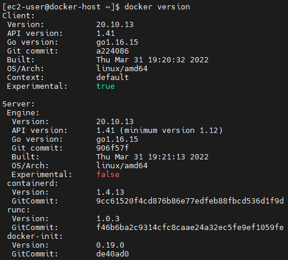
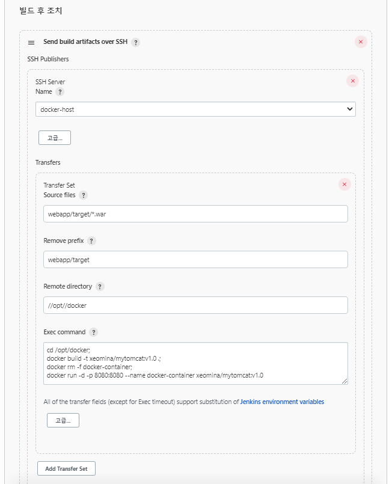
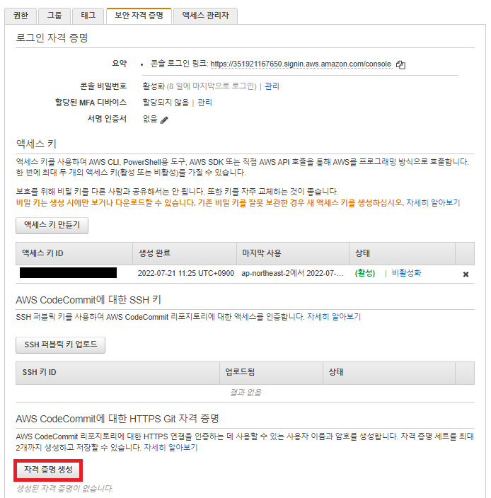
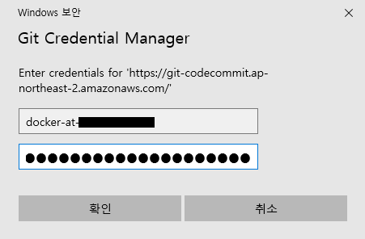
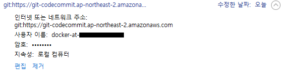

# 0802

* CodeCommit : AWS CI/CD 서비스

# Docker

## Docker host 인스턴스 생성

* 이미지 : AL2
* 인스턴스 유형 : t2.micro
* 키 페어 : docker-key
* 네트워크 : MY-PUBLIC-SUBNET-2C
* 보안그룹 : DEV-SG
* 사용자 데이터 : Docker host 환경 설치

```
#!/bin/bash
timedatectl set-timezone Asia/Seoul
hostnamectl set-hostname docker-host
amazon-linux-extras install docker -y
systemctl enable --now docker
curl https://raw.githubusercontent.com/docker/docker-ce/master/components/cli/contrib/completion/bash/docker -o /etc/bash_completion.d/docker.sh
usermod -a -G docker ec2-user
```


* docker-host 확인

```
$ docker version
```




## Docker와 Jenkins 통합

### Docker 서버 password 설정

* password 생성

```
$ sudo passwd ec2-user
```


* password 허용

```
$ sudo vi /etc/ssh/sshd_config
PasswordAuthentication yes
#PermitEmptyPasswords no
#PasswordAuthentication no
```


* restart

```
$ sudo systemctl restart sshd
$ exit
```


### Dockerfile 생성

```
$ sudo mkdir /opt/docker
$ sudo vi /opt/docker/Dockerfile
FROM tomcat:9										# base image
RUN cp -R /usr/local/tomcat/webapps.dist/* /usr/local/tomcat/webapps	 # 임시 컨테이너 안에서 또다른 컨테이너 안으로 복사
COPY ./*.war /usr/local/tomcat/webapps					# 외부의 도커 호스트에 있는 war 파일을 컨테이너 안의 경로로 복사
```


---

**Cf) 아래의 명령을 수행하는 이유**

```
RUN cp -R /usr/local/tomcat/webapps.dist/* /usr/local/tomcat/webapps
```

* docker run 해보기
  * -p 8080:8080  = `호스트 port` : `컨테이너 port`

````
$ docker run -d -p 8080:8080 --name test-tomcat tomcat:9
$ docker ps
$ ss -nat | grep 8080
````


* docker 웹 접속
  * 아직...홈페이지 꾸미지 않음


* 페이지 복원

```
$ docker exec -it test-tomcat bash
# ls
# cp -R webapps.dits/* webapps
# ls webapps
```


*  웹 재접속


* **결론 : tomcat 웹서버가 깨지지 않고 출력되도록 하기 위해...**


---


* 권한 설정
  * Jenkins가 `ec2-user` 이름으로 docker 이용할 수 있도록

```
$ cd /opt/docker/
$ sudo chown -R ec2-user:ec2-user /opt/docker
```


### Jenkins 웹 UI

* Jenkins 접속


* 플러그인 설치


* 시스템 설정


* Publish over SSH


* Create Project
  * Copy from `BuildOnDeployJob`


* Project 설정
  * `BuildOnDeployJob`과 거의 유사


* 빌드 후 조치 수정

  * `Source files` : mvn이 `war` 파일을 만드는 경로 명시

    * `BuildAndDeployOnContainer/webapp/target/*.war`

  * `Remove prefix` : ssh로 docker host로 보낼 때 `war` 파일만.. 경로 지워도 됨

    * `webapp/target`

  * `Remote directory` : docker host의 경로

    * `//opt//docker`
      * `//` : 두번 쓰면 root 하위 경로
      * `/` : 한번만 쓰면 경로가 생성됨

  * Exec command

    *  동일한 이름으로 컨테이너 생성 반복됨.. 삭제해서 충돌 방지 !

    ```
    cd /opt/docker;
    docker build -t xeomina/mytomcat:v1.0 .;	# Dockerfile 찾아서 tag 로 build
    docker rm -f docker-container;			# docker container 삭제
    docker run -d -p 8080:8080 --name docker-container xeomina/mytomcat:v1.0	# 컨테이너 생성
    ```



* 빌드


* dokcer 웹 접속
  * `docker.xeomina.shop:8080/webapp/`


### Git Bash

```
$ git clone -b master http://gitlab.xeomina.shop/xeomina/dev-site.git
$ cd /dev-site/webapp/src/main/webapp
$ vi index.jsp
$ git add index.jsp
$ git status
$ git commit -m "Update title"
$ git push origin master
```


* 자동 빌드


* docker 웹 접속


# AWS CodeCommit

## Repository 생성

* git-test


* HTTPS 복제

```
https://git-codecommit.ap-northeast-2.amazonaws.com/v1/repos/git-test
```


## GitBash에서 Repository Clone

* git credential manager 팝업

```
$ https://git-codecommit.ap-northeast-2.amazonaws.com/v1/repos/git-test
```


### Git  자격증명 생성

* AWS IAM > 사용자 > `docker`


* AWS CodeCommit에 대한 HTTPS Git 자격 증명 생성



* 사용자 이름 및 비밀번호 확인
  * `csv` 파일 다운로드


* 사용자 이름과 비밀번호 입력



* bash
  * empty repo : init 및 git config 필요 없음

```
$ git clone https://git-codecommit.ap-northeast-2.amazonaws.com/v1/repos/git-test
$ cd git-test
$ ls
$ ls -al
```


* 제어판




* bash

```
$ echo "Hello World" > README.txt
$ git add README.txt
$ git commit -m "Add README.txt"
$ git push origin master
```


* 리포지토리 확인


## 원격 저장소 마이그레이션

* Gitlab에서 AWS codecommit으로 마이그레이션

```
$ mkdir git-migration
$ git clone --mirror http://gitlab.xeomina.shop/xeomina/dev-site.git git-migration
$ cd git-migration/
$ ls
```


* push
  * error

```
$ git push https://git-codecommit.ap-northeast-2.amazonaws.com/v1/repos/git-test --all
```


* `-uf` 옵션 필요

```
$ git push -uf https://git-codecommit.ap-northeast-2.amazonaws.com/v1/repos/git-test --all
```


* 확인


## Jenkins

### Create Project

* BuildAndDeployOnContainerWithCodecommit


* 빌드


## Gitbash

```
cd ~
  215  rm -rf git-test/
  216  git clone https://git-codecommit.ap-northeast-2.amazonaws.com/v1/repos/git-test
  217  cd git-test/
  218  ls
  219  vi webapp/src/main/webapp/index.jsp
```


```
git add .
  221  git commit -m "Update Masthead"
  222  git push origin master

```


* 자동 빌드


* 웹 페이지 확인

