# 0803

# Ansible

## Ansible 인스턴스 생성

- 이미지 : AL2
- 인스턴스 유형 : t2.micro
- 키 페어 : docker-key
- 네트워크 : MY-PUBLIC-SUBNET-2C
- 보안그룹 : DEV-SG
- 사용자 데이터 : Docker host 환경 설치

```
#!/bin/bash
timedatectl set-timezone Asia/Seoul
hostnamectl set-hostname ansible-server
amazon-linux-extras install -y ansible2
amazon-linux-extras install -y docker
systemctl enable --now docker
curl https://raw.githubusercontent.com/docker/docker-ce/master/components/cli/contrib/completion/bash/docker -o /etc/bash_completion.d/docker.sh
usermod -a -G docker ec2-user
```

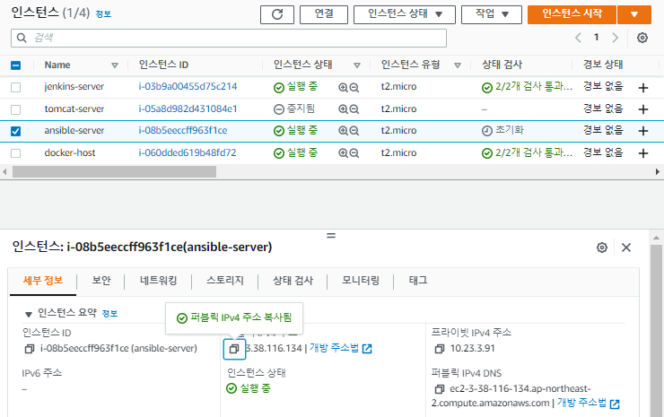

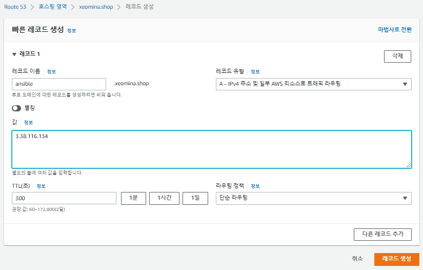


## Ansible 애드혹 (AD-HOC)

* ansible version

```
$ ansible --version
```

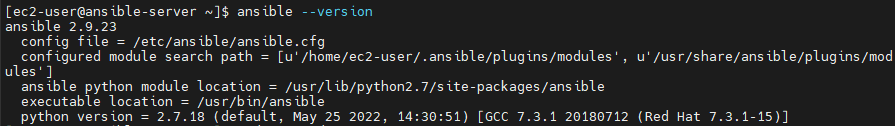


* Password Authentication 

```
$ sudo vi /etc/ssh/sshd_config
PasswordAuthentication yes
#PermitEmptyPasswords no
#PasswordAuthentication no
```

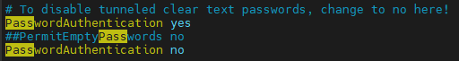

* restart sshd

```
$ sudo systemctl restart sshd
```

* password access

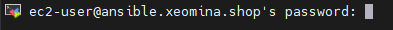

* ansible known hosts
  * docker private IP : 10.23.40.30

```
$ sudo vi /etc/ansible/hosts
[docker-host]
10.23.40.30
```

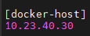

* ping
  * Permission denied 에러

```
$ ansible all -m ping
```

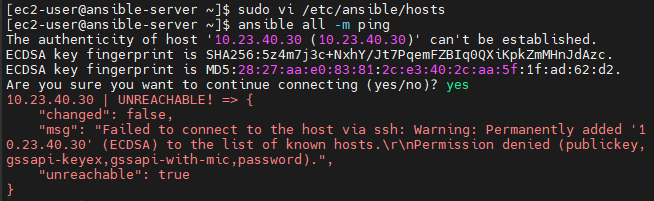

* ping `-k` : passwd로 접근

```
$ ansible all -m ping -k
```

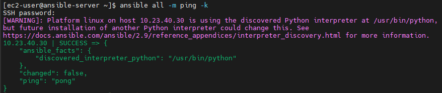

* keygen

```
$ ssh-keygen -t rsa
```

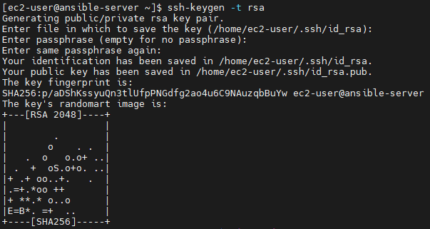

* copy key

```
$ ssh-copy-id 10.23.40.30
```

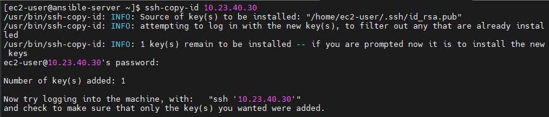

* ping

```
$ ansible all -m ping
```

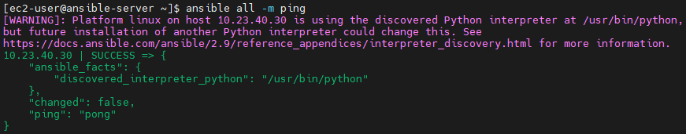

* command
  * `uptime` : 시스템 가동 시간 등 확인
  * `docker ps` : docker container 확인

```
$ ansible all -m command -a uptime
$ ansible all -m command -a "docker ps -a"
```

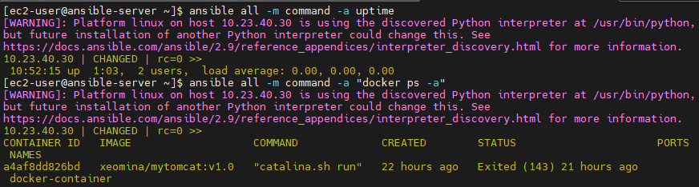

* docker dir 생성

```
$ sudo mkdir /opt/docker
$ sudo chown -R ec2-user:ec2-user /opt/docker
$ cd /opt/docker/
$ ll
```

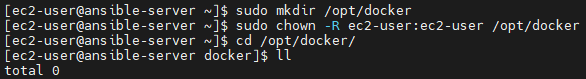


# Jenkins

## System Configuration

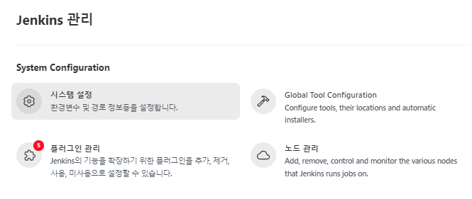

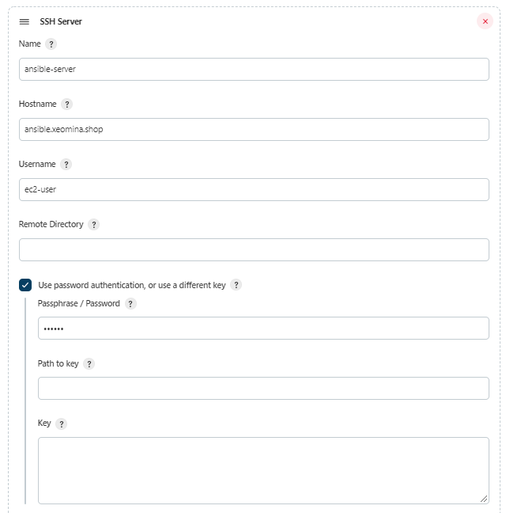

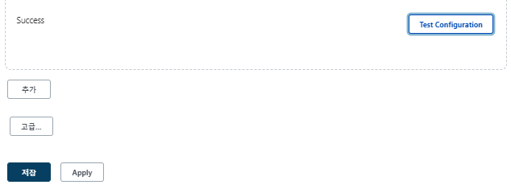


## Create Project

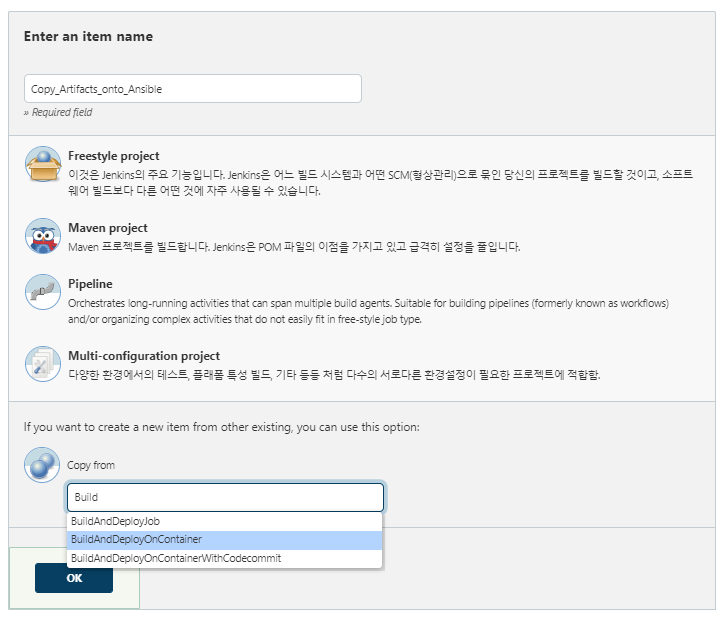

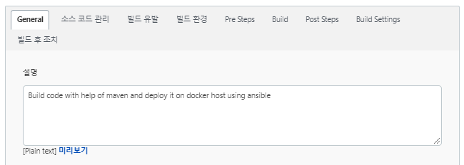

* modify
  * `Poll SCM` uncheck

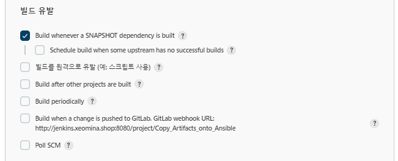

* 빌드 후 조치

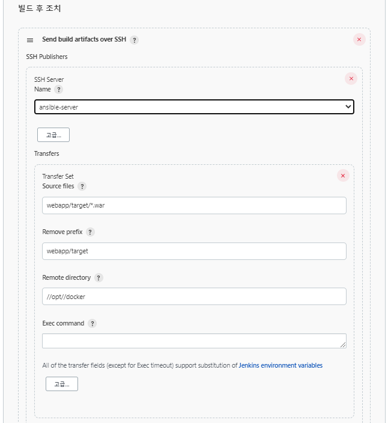


* 소스 코드 관리
  * github

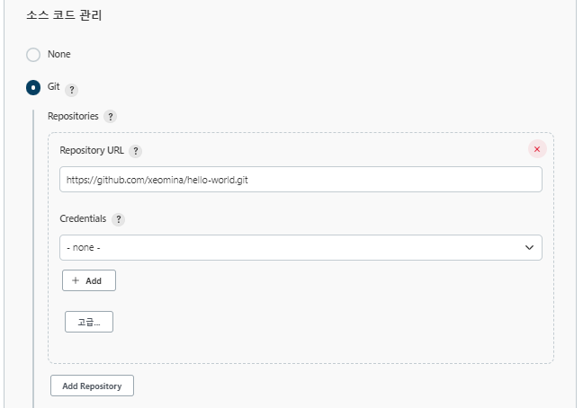


## Build

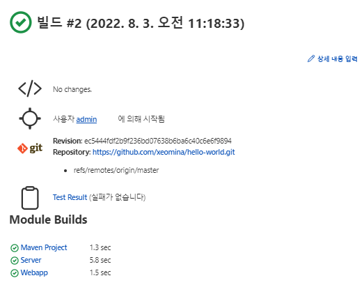


* `war` file
  * mvn create > jenkins deploy ?

```
$ ll
```

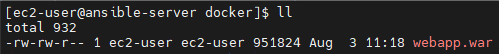


# Docker

## Dockerfile 

* Dockerfile 생성
  * war 파일을 컨테이너 안의 경로로 복사
  * `COPY <host> <container 경로>`

```
$ vi Dockerfile
FROM tomcat:9
RUN cp -R /usr/local/tomcat/webapps.dist/* /usr/local/tomcat/webapps
COPY ./*.war /usr/local/tomcat/webapps
```

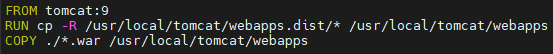

* image build

```
$ docker build -t xeomina/mytomcat:v1.0 .
$ docker images
```

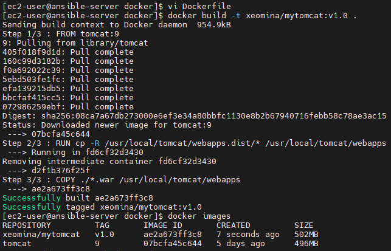

* docker container

```
$ docker run -d -p 8080:8080 --name test-container xeomina/mytomcat:v1.0
$ ss -nat | grep 8080
$ ll
```

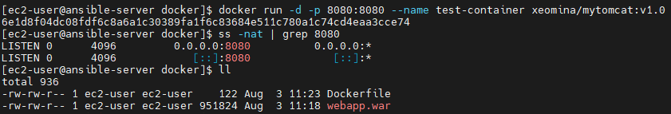


* delete

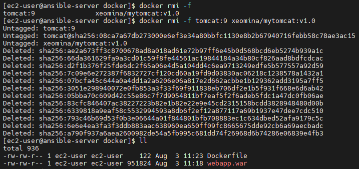


# Ansible 

## Ansible hosts

* ansible hosts

```
$ sudo vi /etc/ansible/hosts
[docker-host]
10.23.40.30

[ansible-server]
10.23.3.91
```

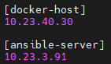

* ping
  * Permission denied

```
$ ansible all -m ping
```

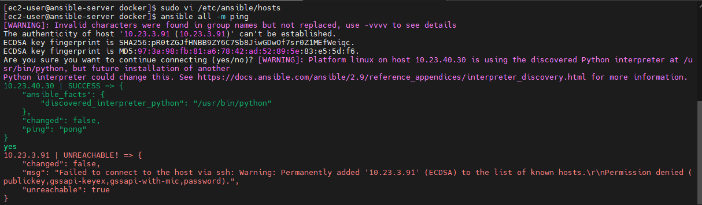

* copy key

```
$ ssh-copy-id 10.23.3.91
$ ansible all -m ping
```

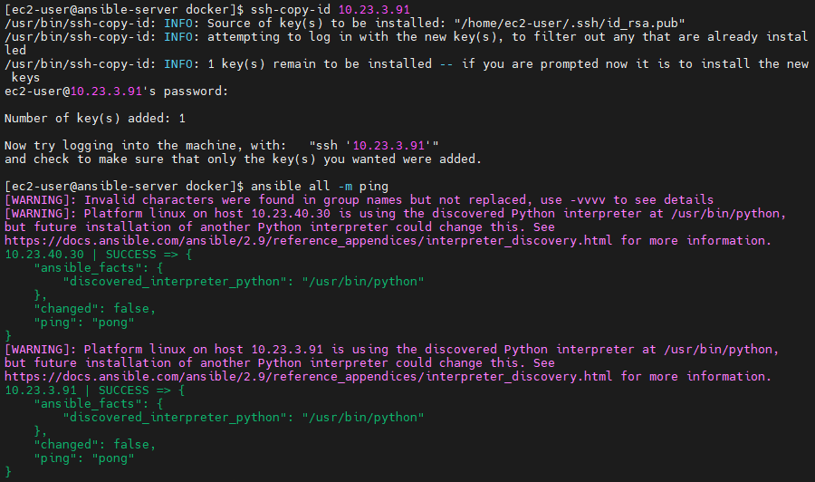


# Docker

## build.yml

* `yaml`

```
$ vi build.yml
- hosts: ansible-server

  tasks:
  - name: create docker image
    command: docker build -t xeomina/mytomcat:v1.0 .
    args:
      chdir: /opt/docker

  - name: push docker image
    command: docker push xeomina/mytomcat:v1.0
```

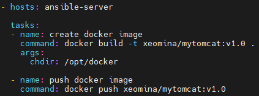

* docker login

```
$ docker login
```

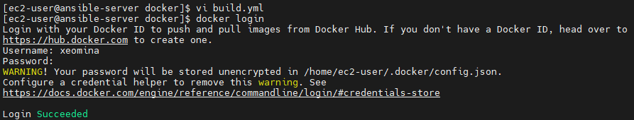

* playbook

```
$ ansible-playbook build.yml
```

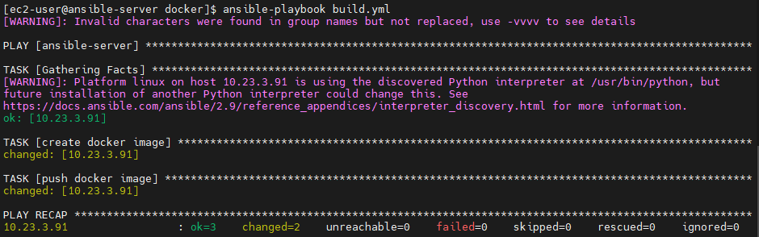

* image

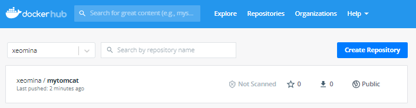

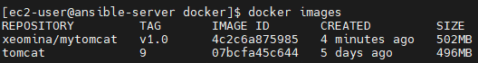


# Jenkins

## Project 구성 수정

* 빌드 후 조치
  * Exec command

```
cd /opt/docker;
ansible-playbook build.yml
```

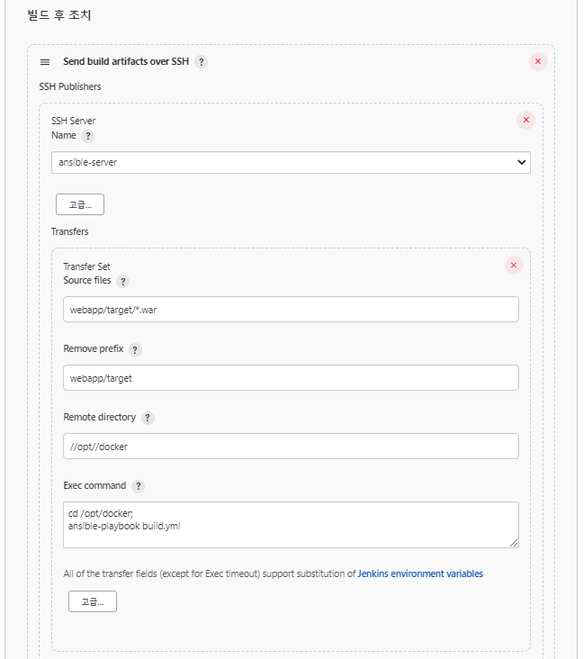


## 빌드

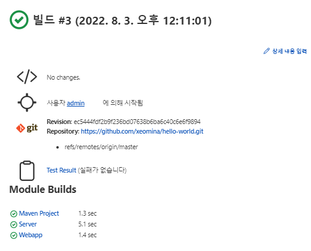

* image 확인

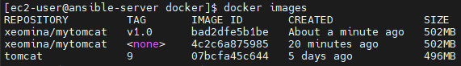


# Docker

## deploy.yml

*

```
$ vi deploy.yml
- hosts: docker-host

  tasks:
  - name: remove container
    command: docker rm -f docker-container
  - name: remove image
    command: docker rmi -f xeomina/mytomcat:v1.0
  - name: create container
    command: docker run -d -p 8080:8080 --name docker-container xeomina/mytomcat:v1.0
```

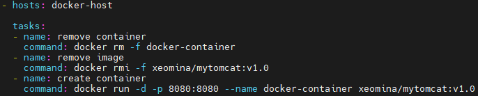


* playbook

```
$ ansible-playbook deploy.yml
```

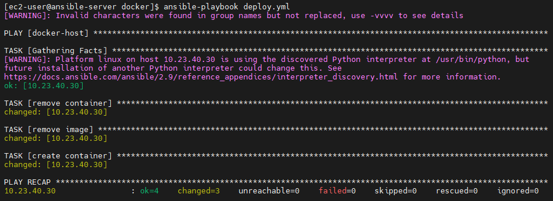

* docker.xeomina.shop

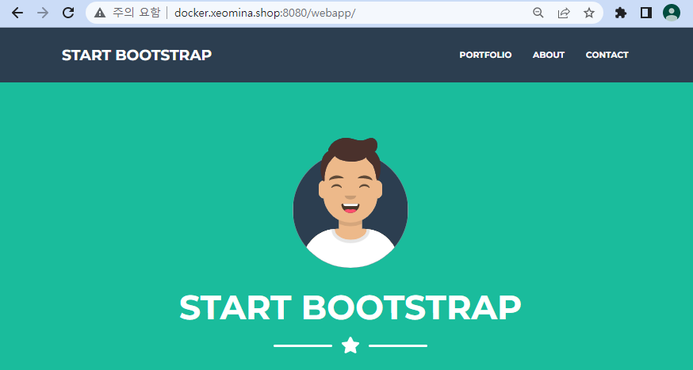


## container 

*

```
```

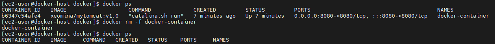

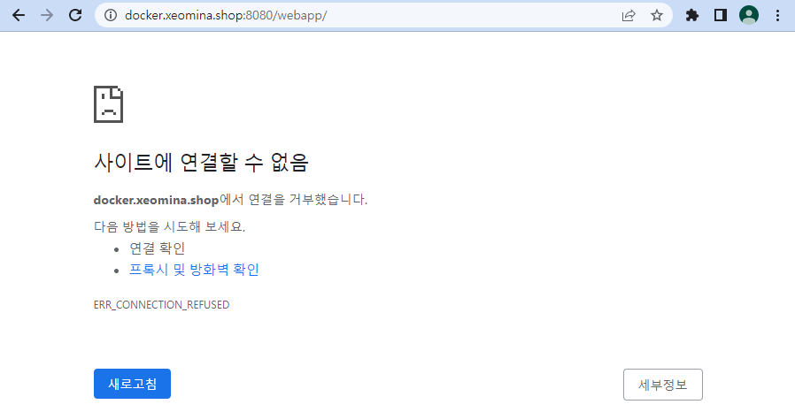

# Jenkins

## Project 구성 수정

* 자동 빌드

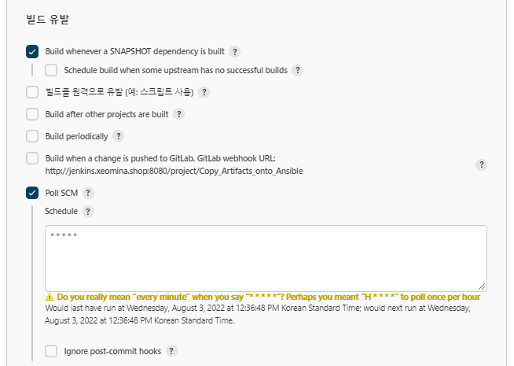


* Exec command
  * play build > sleep > play deploy

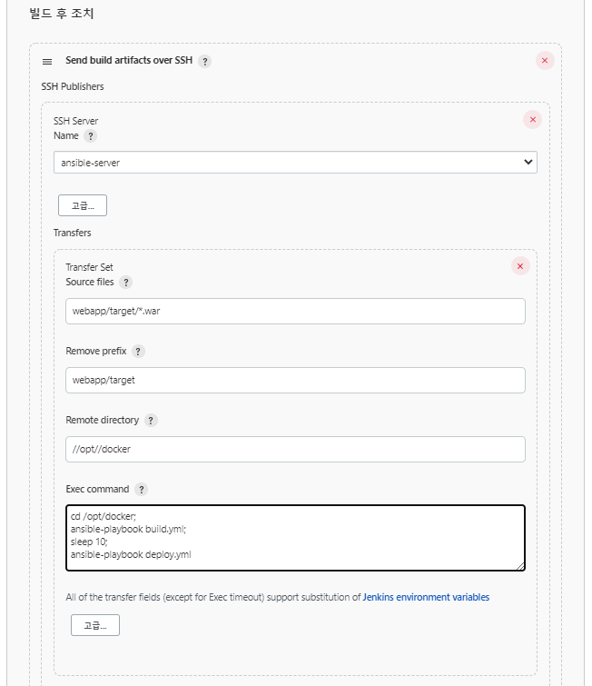


## 빌드

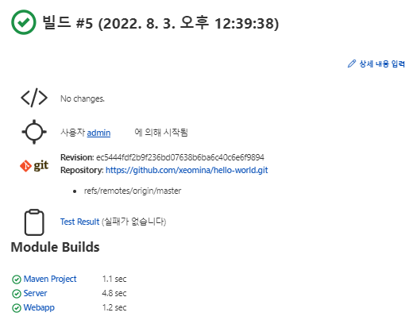

* docker.xeomina.shop:8080/webapp/

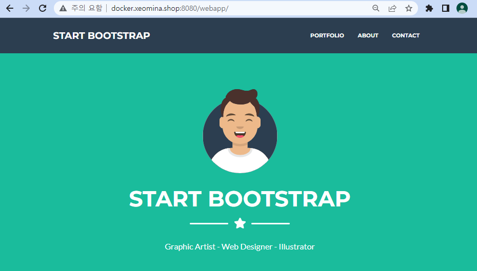


## GitBash

* clone

```
$ git clone https://github.com/xeomina/hello-world.git
$ cd hello-world/
$ ls
$ cd webapp/src/main/webapp/
$ ls
```

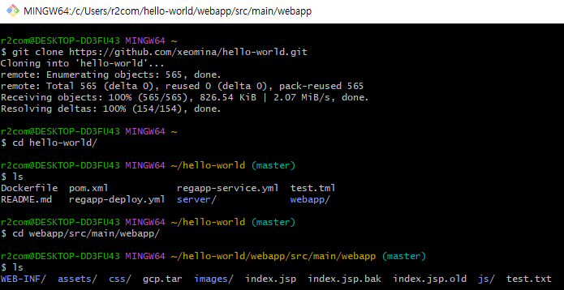

* 소스수정 & push

```
$ vi index.jsp
$ git add .
$ git commit -m "Update Page"
$ git push origin master
```

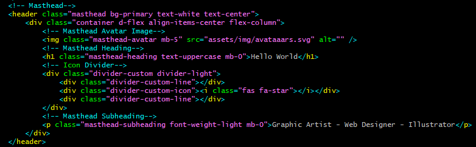

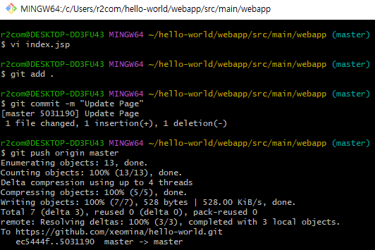


* 자동빌드


* docker.xeomina.shop


# CI/CD Pipeline

