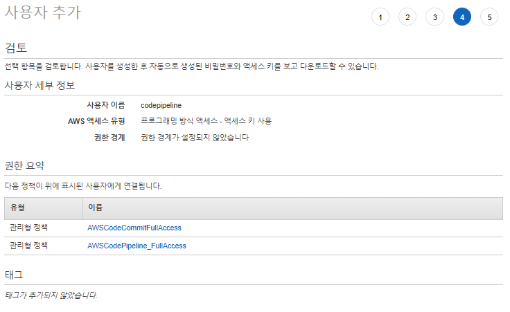
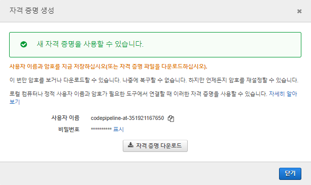
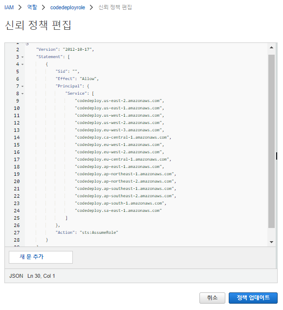
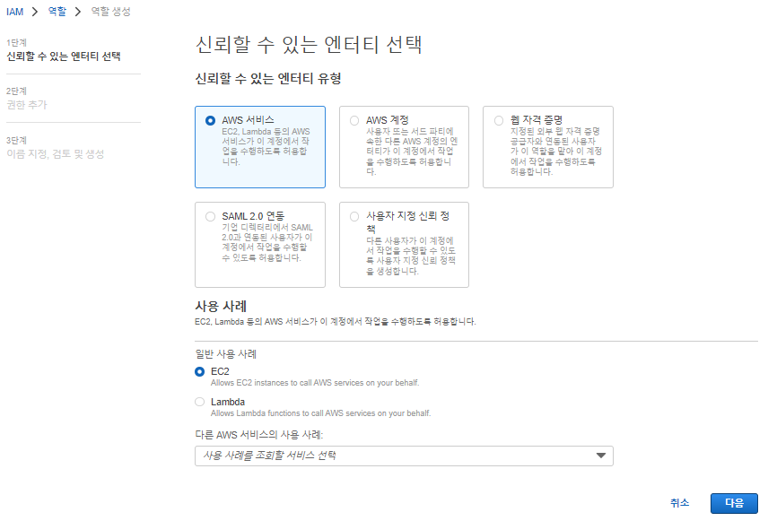
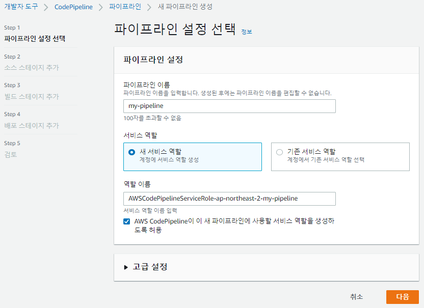
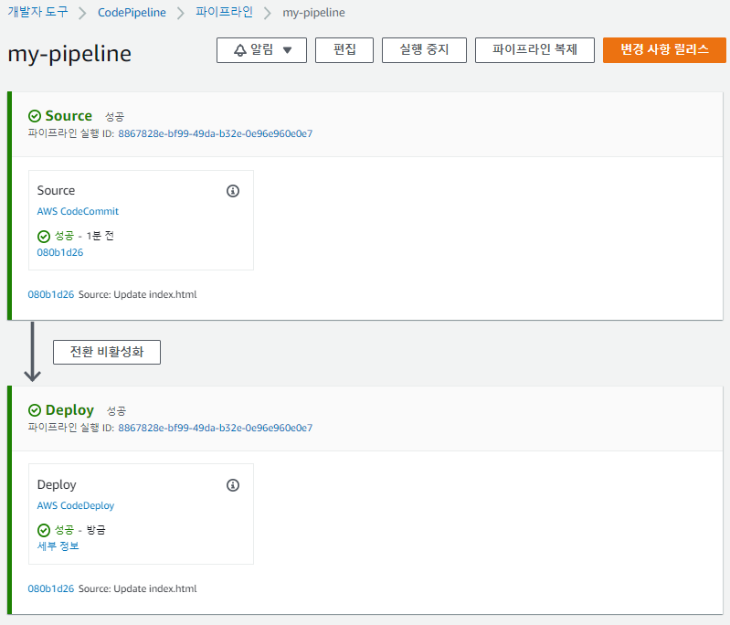

# 0822

# AWS CI/CD 

### Cloud9


### IAM

1) 사용자 추가 > 기존 정책 직접 연결 > csv 다운로드 > 생성된 사용자 클릭 > 보안 자격 증명 > 자격 증명 생성 > 자격 증명 다운로드


* codecommit 권한


* codepipeline 권한


* 검토



* csv 다운로드


* 사용자 생성 확인


* HTTPS GIT 자격 증명 생성


* csv 파일 다운로드




### codecommit

> Cloud9과 CodeCommit 설정 및 소스 등록

CodeCommit 리포지토리 생성 > HTTPS 복제 > index.html과 appspec.yml 파일 작성(아래 내용 붙여넣기)


```
https://git-codecommit.ap-northeast-2.amazonaws.com/v1/repos/codepipeline-repo
```


### Cloud9

* vi index.html

```
<!DOCTYPE html>
<html>
<head>
  <meta charset="utf-8">
  <title>Sample Deployment</title>
  <style>
    body {
      color: #ffffff;
      background-color: #0188cc;
      font-family: Arial, sans-serif;
      font-size: 14px;
    }
    h1 {
      font-size: 500%;
      font-weight: normal;
      margin-bottom: 0;
    }
    h2 {
      font-size: 200%;
      font-weight: normal;
      margin-bottom: 0;
    }
  </style>
</head>
<body>
  <div align="center">
    <h1>Congratulations</h1>
    <h2>This application was deployed using AWS CodePipeline.</h2>
    <p>For next steps, read the <a href="http://aws.amazon.com/documentation/codedeploy">AWS CodeDeploy Documentation</a>.</p>
  </div>
</body>
</html>
```


* vi appspec.yml

```
version: 0.0
os: linux
files:
  - source: /index.html
    destination: /var/www/html/
hooks:
  BeforeInstall:
    - location: scripts/install_dependencies
      timeout: 300
      runas: root
    - location: scripts/start_server
      timeout: 300
      runas: root
  ApplicationStop:
    - location: scripts/stop_server
      timeout: 300
      runas: root
```

* `scripts` 폴더 생성

```
mkdir scripts
cd scripts
```

* `install_dependencies`

```
vi install_dependencies
#!/bin/bash
yum install -y httpd
```

* `start_server`

```
vi start_server
#!/bin/bash
systemctl start httpd
```

* `stop_server`

```
vi stop_server
#!/bin/bash
isExistApp = `pgrep httpd`
if [[ -n $isExistApp ]]; then
     systemctl stop httpd
fi
```

* push

```
cd ..
git add .
git status
git commit -m "Uploade dev files"
git push
```


서비스 역할 및 IAM 인스턴스 프로파일 생성
IAM > 역할만들기 > CodeDeploy 사용 사례 선택 > AWSCodeDeployRole 권한 추가 > 생성한 역할 클릭 > 신뢰 정책(위임) 편집(아래 내용 붙여넣기)




```
{
    "Version": "2012-10-17",
    "Statement": [
        {
            "Sid": "",
            "Effect": "Allow",
            "Principal": {
                "Service": [
                    "codedeploy.us-east-2.amazonaws.com",
                    "codedeploy.us-east-1.amazonaws.com",
                    "codedeploy.us-west-1.amazonaws.com",
                    "codedeploy.us-west-2.amazonaws.com",
                    "codedeploy.eu-west-3.amazonaws.com",
                    "codedeploy.ca-central-1.amazonaws.com",
                    "codedeploy.eu-west-1.amazonaws.com",
                    "codedeploy.eu-west-2.amazonaws.com",
                    "codedeploy.eu-central-1.amazonaws.com",
                    "codedeploy.ap-east-1.amazonaws.com",
                    "codedeploy.ap-northeast-1.amazonaws.com",
                    "codedeploy.ap-northeast-2.amazonaws.com",
                    "codedeploy.ap-southeast-1.amazonaws.com",
                    "codedeploy.ap-southeast-2.amazonaws.com",
                    "codedeploy.ap-south-1.amazonaws.com",
                    "codedeploy.sa-east-1.amazonaws.com"
                ]
            },
            "Action": "sts:AssumeRole"
        }
    ]
}
```

정책 > 정책 생성 > JSON > 아래 내용 붙여넣기


역할 만들기 > EC2 선택 > AmazonS3FullAccess, CodeDeployEC2 추가




### 3)  EC2 생성과 CodeDeploy 배포 그룹 생성

* 이름 : prd-server
* 보안그룹 : 80 포트 open
* IAM 역할 추가


* 사용자 데이터

```
#!/bin/bash
yum update -y
yum install -y ruby
curl -O https://aws-codedeploy-ap-northeast-2.s3.amazonaws.com/latest/install
chmod +x ./install
sudo ./install auto
```


### CodeDeploy


### 파이프라인

CodePipeline > 파이프라인 > 새 파이프라인 생성




* `prd-server` IP 접속


* index.html 수정


* push

```
git add .
git status
git commit -m "Update index.html"
git push origin master
```


* 파이프라인 확인



* 웹 페이지 확인

